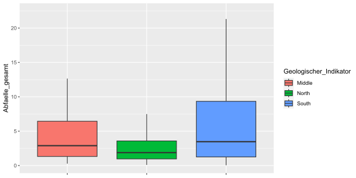
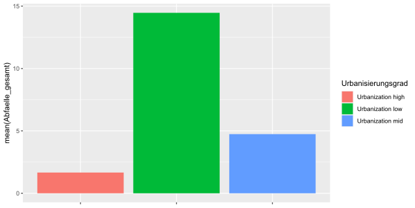

# Derivation of Waste Management Profiles (*WIP*)

## Todos:
- [ ] references: ~bartlett test~, ~kmo~, pca, fa
- [ ] clustering: diana, mona, agnes, k-means
- [ ] profiling
- [ ] output code

## Context
Although only about 15% of all waste within the EU is generated as municipal waste[^bignote], the absolute figures pose a major problem for municipalities, waste management companies and the environment. 225.7 million tonnes of municipal waste were collected in the EU in 2020, of which only 68 million tonnes were directly recycled, with the remainder going into long-term landfill or being incinerated for energy generation. In view of the climate-damaging landfill gases produced during storage or CO2 emissions during incineration, combined with the problem of the large amount of space required, the EU's goal is to constantly optimise its waste management. This is intended to promote the production of less waste, a stronger circular economy and the economic efficiency of waste management.
In the context of this optimisation, we want to work out a status quo of municipal waste management in Italian municipalities, on which subsequent optimisation projects can build. For this purpose, we base our work on a data set on the waste management of a total of 4341 Italian municipalities. With the help of these data, we are to draw up profiles of the municipalities, which we can cluster them with regard to their descriptive characteristics, in particular the key figures of waste management, but also geographical and economic factors.


[^bignote]: Municipal waste is all waste collected and treated by or for municipalities. It includes waste from households
including bulky waste, similar waste from trade and commerce, office buildings, institutions and small businesses, as well as yard and garden waste, street sweepings and the contents of waste containers.
yard and garden waste, street sweepings and the contents of waste containers. The definition includes waste from municipal
sewage networks and their treatment as well as waste from construction and demolition work.

## Exploratory Data Analysis
Get an overview of what the data set is about.
```r
wm_df <- load2("data/waste_management.RData")
skimr::skim(wm_df)
#wm_df %>% complete.cases() %>% sum()
```
<details>
  <summary>(<i>click to show/hide console output</i>)</summary>
  <!-- have to be followed by an empty line! -->

```
── Data Summary ────────────────────────
                           Values
Name                       wm_df 
Number of rows             4341  
Number of columns          36    
_______________________          
Column type frequency:           
  character                5     
  numeric                  31    
________________________         
Group variables            None  
── Variable type: character ────────────────────────────────────────────────────────────────────────────────────────────────────
  skim_variable     n_missing complete_rate min max empty n_unique whitespace
1 Region                    0         1       5  21     0       20          0
2 Provinz                   0         1       4  21     0      102          0
3 Gemeinde                  6         0.999   2  60     0     4333          0
4 Gebuehrenregelung         0         1       4   8     0        2          0
5 Region_PAYT               0         1       2   4     0        2          0

── Variable type: numeric ──────────────────────────────────────────────────────────────────────────────────────────────────────
   skim_variable          n_missing complete_rate        mean         sd      p0      p25      p50      p75      p100 hist 
 1 ID                             0         1     47470.      30090.     1272    18135    42015    70049     111107   ▇▃▅▃▃
 2 Flaeche                        6         0.999    41.0        56.8       0.12    10.8     22.7     47.5     1287.  ▇▁▁▁▁
 3 Bevoelkerung                   0         1     10204.      53426.       34     1579     3535     8199    2617175   ▇▁▁▁▁
 4 Bevoelkerungsdichte            6         0.999   405.        771.        2.48    62.6    151.     399.     12123.  ▇▁▁▁▁
 5 Strassen                     443         0.898   102.        310.        1       25       51      105      14970   ▇▁▁▁▁
 6 Inselgemeinde                  6         0.999     0.00507     0.0711    0        0        0        0          1   ▇▁▁▁▁
 7 Kuestengemeinde                6         0.999     0.168       0.374     0        0        0        0          1   ▇▁▁▁▂
 8 Urbanisierungsgrad             6         0.999     2.49        0.595     1        2        3        3          3   ▁▁▆▁▇
 9 Geologischer_Indikator       285         0.934     2.29        0.888     1        1        3        3          3   ▃▁▂▁▇
10 Abfaelle_gesamt                0         1         5.31       32.5       0.02     0.61     1.52     3.95    1692.  ▇▁▁▁▁
11 Abfaelle_sortiert              0         1         3.25       15.6       0        0.37     1.04     2.73     765.  ▇▁▁▁▁
12 Abfaelle_unsortiert            0         1         2.04       17.6       0.01     0.18     0.41     1.06     927.  ▇▁▁▁▁
13 Sortierungsgrad                0         1        60.1        19.8       0       44.3     64.3     76.5       97.5 ▁▃▅▇▅
14 Sort_Bio                     511         0.882    22.3        12.7       0.01    11.1     25.0     31.8       61.6 ▅▅▇▂▁
15 Sort_Papier                   25         0.994    11.0         3.88      0        8.66    10.9     13.1       45.3 ▃▇▁▁▁
16 Sort_Glas                     33         0.992     9.41        3.71      0        7.15     9.1     11.3       39.8 ▅▇▁▁▁
17 Sort_Holz                   1095         0.748     4.11        2.72      0        2.08     4.02     5.71      25.1 ▇▃▁▁▁
18 Sort_Metall                  246         0.943     1.76        1.35      0        0.88     1.54     2.35      20.7 ▇▁▁▁▁
19 Sort_Plastik                  39         0.991     6.11        3.26      0        4.13     5.79     7.55      31.6 ▇▆▁▁▁
20 Sort_Elektrik                314         0.928     1.23        0.821     0        0.78     1.18     1.57      18.0 ▇▁▁▁▁
21 Sort_Textil                 1013         0.767     0.757       0.688     0        0.35     0.63     0.99      10.6 ▇▁▁▁▁
22 Sort_Rest                    136         0.969     7.94        5.15      0.03     3.96     7.13    11.1       37.2 ▇▆▂▁▁
23 Verwendung_Energie             0         1        20.3        15.7       0        5.63    18.5     38.5       55.1 ▇▃▂▇▁
24 Verwendung_Deponie             0         1        17.9        19.5       0        4.55    11.3     31.5       76.7 ▇▁▂▁▁
25 Verwendung_Recycling           0         1        41.3        12.8       2.35    32.7     43.2     51.6       76.7 ▁▅▇▇▁
26 Verwendung_Unbekannt           0         1        20.5        17.8       0        5.21    17.8     31.0       97.4 ▇▅▂▁▁
27 Steuern_gewerblich           386         0.911 16565.      14132.     4180.    9080.   12465.   19413.    377492.  ▇▁▁▁▁
28 Steuern_privat               285         0.934 13211.       3649.     2606.   10162.   13668.   15759.     35770.  ▂▇▃▁▁
29 Kosten_Basis                   0         1       154.         76.1      25.7    108.     137.     179.       977.  ▇▁▁▁▁
30 Kosten_Sortierung             67         0.985    52.7        33.1       3.39    31.3     48.9     66.4      582.  ▇▁▁▁▁
31 Kosten_sonstiges              52         0.988    54.2        43.2       4.27    27.3     41.7     66.5      670.  ▇▁▁▁▁
```
</details>

There are quite a lot of missing values. Omitting all of them would mean a loss of more than 50 % of the data.
Create some plots to enhance the understanding of the data set:
```r
wm_df %>% na.omit %>% 
  ggplot(aes(x=Region, y=Abfaelle_gesamt)) +
  geom_boxplot(aes(fill = Region), outlier.shape = 2,
               outlier.colour = "black",
               outlier.alpha = .5) +
  theme(aspect.ratio = 1) +
  theme(axis.title.x = element_blank(),
        axis.text.x = element_text(angle = 90, vjust = 0.5, hjust=1),
        legend.position = "none")
```

<p align = "center">
  <picture>
    
  </picture>
</p>


A lot of outliers in total amounts of waste per community. I am going to take care of them later. Til then they will be hidden, so other values appear less compressed.

```r
wm_df %>% na.omit %>% 
  ggplot(aes(x=Region, y=Abfaelle_gesamt)) +
  geom_boxplot(aes(fill = Region), outlier.shape = NA) +
  theme(aspect.ratio = 1) +
  coord_flip() +
  coord_fixed(ylim = c(0, 29)) +
  theme(axis.title.x = element_blank(),
        axis.text.x = element_text(angle = 90, vjust = 0.5, hjust=1),
        legend.position = "none")
```
<p align = "center">
  <picture>
    
  </picture>
</p>

```r
wm_df %>% na.omit %>% 
  mutate(Geologischer_Indikator = ifelse(Geologischer_Indikator == 1, "South", ifelse(Geologischer_Indikator == 2, "Middle", "North"))) %>% 
  ggplot(aes(x=Geologischer_Indikator, y=Abfaelle_gesamt)) +
  geom_boxplot(aes(fill = Geologischer_Indikator), outlier.shape = NA) +
  coord_cartesian(ylim = quantile(wm_df$Abfaelle_gesamt, c(0, 0.97))) +
  theme(axis.title.x = element_blank(),
        axis.text.x = element_blank())
```
<p align = "center">
  <picture>
    
  </picture>
</p>

```r
wm_df %>%
  na.omit %>%
  mutate(Urbanisierungsgrad =
           ifelse(Urbanisierungsgrad == 1, "low",
                  ifelse(Urbanisierungsgrad == 2, "mid",
                         "high")
  )) %>% 
  ggplot(aes(y=Abfaelle_gesamt)) +
  geom_point(aes(x=Bevoelkerung, colour = Urbanisierungsgrad))
```
<p align = "center">
  <picture>
    
  </picture>
</p>

```r
wm_df %>% na.omit %>% 
  mutate(Urbanisierungsgrad = ifelse(Urbanisierungsgrad == 1, "Urbanization low",
                                     ifelse(Urbanisierungsgrad == 3, "Urbanization high",
                                            "Urbanization mid"))) %>% 
  ggplot(aes(x=Urbanisierungsgrad, y=Abfaelle_gesamt)) +
  stat_summary(aes(group = Urbanisierungsgrad, fill = Urbanisierungsgrad), fun = mean, geom = "bar") +
  labs(y = "mean(Abfaelle_gesamt)") +
  theme(axis.title.x = element_blank(),
        axis.text.x = element_blank())
```
<p align = "center">
  <picture>
    
  </picture>
</p>


Inspecting missing values within the waste sorting related columns:

```r
sapply(wm_df[,16:25],
       function(y) sum(length(which(is.na(y))))) %>%
  tibble(Column = names(.),
         NA_Count = .)
```
<details>
  <summary>(<i>click to show/hide console output</i>)</summary>
  <!-- have to be followed by an empty line! -->

```
# A tibble: 10 × 2
   Column          NA_Count
   <chr>              <int>
 1 Sortierungsgrad        0
 2 Sort_Bio             511
 3 Sort_Papier           25
 4 Sort_Glas             33
 5 Sort_Holz           1095
 6 Sort_Metall          246
 7 Sort_Plastik          39
 8 Sort_Elektrik        314
 9 Sort_Textil         1013
10 Sort_Rest            136
```
</details>

```r
Sort_NAs <- c()
for (i in 17:25) {
  nas_t <- which(is.na(wm_df[i]))
  Sort_NAs <- c(Sort_NAs, nas_t)
}

Sort_NAs_table <- Sort_NAs %>% table %>% sort(decreasing = T)
Sort_NAs_table[1:5] %>% names %>% as.numeric -> t

wm_df[t,16:25]
```
<details>
  <summary>(<i>click to show/hide console output</i>)</summary>
  <!-- have to be followed by an empty line! -->

```
     Sortierungsgrad Sort_Bio Sort_Papier Sort_Glas Sort_Holz Sort_Metall Sort_Plastik Sort_Elektrik Sort_Textil Sort_Rest
429             0.72       NA        0.72        NA        NA          NA           NA            NA          NA        NA
3572            0.70       NA          NA        NA        NA          NA           NA           0.7          NA        NA
4175            0.00       NA          NA        NA        NA          NA           NA           0.0          NA        NA
3777           59.32       NA          NA     39.84        NA          NA           NA            NA          NA     19.48
4017            1.87       NA          NA        NA        NA          NA         0.62            NA          NA      1.25
```
</details>

Looks like the sum of the values present in these waste sorting columns equals
the value in Sortierungsgrad. Imputing any values here would completely destroy the logic behind these columns. I would argue that dropping all these values is a viable option. However, one could also say that replacing these NAs with zeros instead might work out as well. The latter option is the one I chose.

## Dimension Reduction

Within the data set there are dimensions that hold no value when it comes to any analyses. "ID" is a unique identifier, "Gemeinde" the name of a community, "Strassen" contains more than 10 % missing values, "Region" and "Provinz" contain too many unique values that would complicate the process a lot. Also the importance of the information they hold is questionable.

```r
cols_to_exclude <- c("ID", "Gemeinde", "Strassen", "Region", "Provinz")
```

A vector containing the names of the columns mentioned is created.
A recipe from the *tidyverse* is used to remove these dimensions, replace missing values via bag imputation and replace outliers in numeric dimension with the IQR limits of their individual column and replace the remaining nominal columns with dummy variables.

Note: *step_impute_constant()* and *step_outliers_iqr_to_limits()* are functions from the *steffanossaR* package found at https://github.com/steffanossa/steffanossaR.

```r
recipe_prep <- recipe(~., data = wm_df) %>% 
  step_rm(all_of(cols_to_exclude)) %>% 
  step_impute_constant(contains("Sort_"), constant = 0) %>% 
  step_impute_bag(all_numeric()) %>% 
  step_outliers_iqr_to_limits(all_numeric()) %>% 
  step_other(all_nominal(), threshold = .001, other = NA) %>% 
  step_naomit(everything(), skip = T) %>% 
  step_dummy(all_nominal()) %>% 
  step_zv(everything())
```
```r
#| include: false
set.seed(187)
wm_df_prepped <- recipe_prep %>% prep %>% bake(new_data = NULL)
```

### Principal Components Analysis (PCA)

A PCA is used to reduce the number of variables by finding principal components of the data, which are new and uncorrelated variables that can explain the most variance in the original data.

First, the *Bartlett Test* is done.
The Bartlett test verifies the null hypothesis that the correlation matrix is equal to the identity matrix, meaning that the variables of a given data set are uncorrelated. If the resulting value is below .05, the null hypothesis is rejected and it is concluded, that the variables are correlated[^2].

[^2]: Reference: https://www.itl.nist.gov/div898/handbook/eda/section3/eda357.htm

```r
psych::cortest.bartlett(cor(wm_df_prepped), n = 100)$p.value
```
<details>
  <summary>(<i>click to show/hide console output</i>)</summary>
  <!-- have to be followed by an empty line! -->

```
[1] 7.24498e-305
```
</details>

The p-value is way below 0.05, there is correlation between the dimensions of the data set.

Next, the *Kaiser-Mayer-Olkin Criterion* (KMO) is looked at.
The KMO measures the adequacy of a dataset for factor analysis.
It ranges from 0 to 1, where a higher value indicates higher suitability.
A value above .6 is generally considered to be the threshold.
However, some sources also consider .5 to be acceptable[^3].

[^3]: Reference: https://www.empirical-methods.hslu.ch/entscheidbaum/interdependenzanalyse/reduktion-der-variablen/faktoranalyse/
```r
psych::KMO(wm_df_prepped)$MSA
```
<details>
  <summary>(<i>click to show/hide console output</i>)</summary>
  <!-- have to be followed by an empty line! -->

```
[1] 0.5593855
```
</details>

0.559 is not very good but I will consider this acceptable.
Now the PCA can be executed.

```r
wm_df_pca <- 
  wm_df_prepped %>% 
  prcomp(scale. = T,
         center = T)
wm_df_pca %>% summary()
```
<details>
  <summary>(<i>click to show/hide console output</i>)</summary>
  <!-- have to be followed by an empty line! -->

```
Importance of components:
                          PC1    PC2       PC3     PC4    PC5     PC6     PC7     PC8     PC9    PC10
Standard deviation     2.5304 2.3626   1.58053 1.34330 1.2244 1.13610 1.02468 0.97962 0.94631 0.92042
Proportion of Variance 0.2208 0.1925   0.08614 0.06222 0.0517 0.04451 0.03621 0.03309 0.03088 0.02921
Cumulative Proportion  0.2208 0.4133   0.49942 0.56164 0.6133 0.65785 0.69405 0.72714 0.75802 0.78723
                          PC11    PC12    PC13    PC14    PC15    PC16    PC17    PC18    PC19   PC20
Standard deviation     0.88246 0.84337 0.80359 0.79668 0.74160 0.71396 0.65133 0.61120 0.55937 0.5464
Proportion of Variance 0.02685 0.02453 0.02227 0.02189 0.01896 0.01758 0.01463 0.01288 0.01079 0.0103
Cumulative Proportion  0.81409 0.83861 0.86088 0.88277 0.90173 0.91931 0.93394 0.94682 0.95761 0.9679
                          PC21    PC22    PC23    PC24    PC25    PC26    PC27    PC28    PC29
Standard deviation     0.47365 0.45303 0.43259 0.39511 0.32494 0.17389 0.09820 0.08775 0.06896
Proportion of Variance 0.00774 0.00708 0.00645 0.00538 0.00364 0.00104 0.00033 0.00027 0.00016
Cumulative Proportion  0.97564 0.98272 0.98917 0.99455 0.99820 0.99924 0.99957 0.99984 1.00000
```
</details>

Taking a look at the first 15 principal components (PC) and the percentage of variance they explain.

```r
wm_df_pca %>% factoextra::fviz_eig(ncp = 15,
                                   addlabels = T)
```

<p align = "center">
  <picture>
    
  </picture>
</p>

The *elbow method* would suggest using three PCs. The cumulative variance of 49.942 % when taking only three is too little to result in useful outcomes.

Another method of evaluating the number of PCs to keep is the *Kaiser Criterion* which states that factors with an eigenvalue above 1 are considered important and should be retained. An eigenvalue above 1 means its factor explains more variance than a single variable would.

```r
factoextra::get_eig(wm_df_pca) %>%
  filter(eigenvalue > 1)
```
<details>
  <summary>(<i>click to show/hide console output</i>)</summary>
  <!-- have to be followed by an empty line! -->

```
      eigenvalue variance.percent cumulative.variance.percent
Dim.1   6.403077        22.079577                    22.07958
Dim.2   5.582012        19.248318                    41.32789
Dim.3   2.498079         8.614065                    49.94196
Dim.4   1.804447         6.222233                    56.16419
Dim.5   1.499178         5.169578                    61.33377
Dim.6   1.290717         4.450747                    65.78452
Dim.7   1.049961         3.620556                    69.40507
```
</details>

7 factors possess eigenvalues above 1 with a cumulative variance of 69.424 %.
A third approach is *Horn's Method*.
Here random data sets with equal size (columns and rows) as the original data set are generated and then a factor analysis is performed on each of them. The retained number of factors are then compared. The idea is that if the number of factors kept in the original data set is similar to the number of factors kept in the random sets, the factors of the original data set are considered not meaningful. If the number of factors of the original data set is larger than the number of factors in the random sets, the factors in the original data set are considered meaningful.

```r
wm_df_prepped %>% paran::paran()
```
<details>
  <summary>(<i>click to show/hide console output</i>)</summary>
  <!-- have to be followed by an empty line! -->

```
Results of Horn's Parallel Analysis for component retention
870 iterations, using the mean estimate

-------------------------------------------------- 
Component   Adjusted    Unadjusted    Estimated 
            Eigenvalue  Eigenvalue    Bias 
-------------------------------------------------- 
1           6.251503    6.403077      0.151573
2           5.449660    5.582012      0.132351
3           2.380970    2.498078      0.117108
4           1.700083    1.804447      0.104363
5           1.406631    1.499177      0.092546
6           1.209020    1.290716      0.081696
-------------------------------------------------- 

Adjusted eigenvalues > 1 indicate dimensions to retain.
(6 components retained)
```
</details>

*Horn's Method* suggests a number of 6 PCs to keep.
I chose to keep 7 with approximately 70 % cumulative variance.
Next, we take a look at the contributions of the original variables to each new PC.

```r
n_PCs <- 7
for (i in 1:n_PCs) {
  factoextra::fviz_contrib(wm_df_pca, "var", axes = i) %>% print
}
```

<p align = "center">
  <picture>
    
  </picture>
    <picture>
    
  </picture>
    <picture>
    
  </picture>
    <picture>
    
  </picture>
    <picture>
    
  </picture>
    <picture>
    
  </picture>
    <picture>
    
  </picture>
</p>


The *psych* package comes with a function that can illustrate the contribution of each original variable to the PCs in one plot.

```r
wm_df_prepped %>%
  psych::principal(nfactors = n_PCs) %>%
  psych::fa.diagram()
```

A new data set is created based on the new dimensions.

```r
wm_df_transformed_pca <- as.data.frame(-wm_df_pca$x[,1:n_PCs])
```

### Factor Analysis (FA)
Like the PCA a factor analysis can be used to reduce the dimensions of a data  set.
However, while the PCA creates uncorrelated variables the FA identifies underlying latent factors that explain the relationships among the original variables in the data set.
The factors the FA puts out might be correlated, so a rotation can be used in make these factors as uncorrelated as possible.

First, a vector containing all rotation methods is created. Then we iterate over each of them using a for-loop.

```r
rot_meth <- c("varimax", "quartimax", "equamax", "oblimin", "oblimax", "promax")

for (rm in rot_meth) {
  invisible(
    readline(
      prompt=paste0("[enter] to show next rotation result")))
  cat("Factor Analysis results. Rotation method: ", rm)
  wm_df_prepped %>% factanal(factors = n_PCs,
                             rotation = rm,
                             lower = 0.01) %>% 
    print
}
```
<details>
  <summary>(<i>click to show/hide console output</i>)</summary>
  <!-- have to be followed by an empty line! -->

```
Factor Analysis results. Rotation method:  varimax
Call:
factanal(x = ., factors = n_PCs, rotation = rm, lower = 0.01)

Uniquenesses:
                   Flaeche               Bevoelkerung        Bevoelkerungsdichte 
                     0.764                      0.050                      0.589 
        Urbanisierungsgrad     Geologischer_Indikator            Abfaelle_gesamt 
                     0.522                      0.172                      0.010 
         Abfaelle_sortiert        Abfaelle_unsortiert            Sortierungsgrad 
                     0.033                      0.115                      0.010 
                  Sort_Bio                Sort_Papier                  Sort_Glas 
                     0.010                      0.537                      0.666 
                 Sort_Holz                Sort_Metall               Sort_Plastik 
                     0.467                      0.645                      0.666 
             Sort_Elektrik                Sort_Textil                  Sort_Rest 
                     0.798                      0.934                      0.526 
        Verwendung_Energie         Verwendung_Deponie       Verwendung_Recycling 
                     0.016                      0.010                      0.010 
      Verwendung_Unbekannt         Steuern_gewerblich             Steuern_privat 
                     0.010                      0.714                      0.303 
              Kosten_Basis          Kosten_Sortierung           Kosten_sonstiges 
                     0.812                      0.895                      0.703 
Gebuehrenregelung_STANDARD           Region_PAYT_Nein 
                     0.865                      0.250 

Loadings:
                           Factor1 Factor2 Factor3 Factor4 Factor5 Factor6 Factor7
Flaeche                     0.271  -0.138           0.335          -0.127         
Bevoelkerung                0.959                   0.127          -0.111         
Bevoelkerungsdichte         0.586   0.155          -0.192                         
Urbanisierungsgrad         -0.677                                                 
Geologischer_Indikator              0.880          -0.206                         
Abfaelle_gesamt             0.974                   0.121          -0.123         
Abfaelle_sortiert           0.962   0.136                                         
Abfaelle_unsortiert         0.871          -0.258   0.153          -0.175         
Sortierungsgrad            -0.293   0.310   0.655  -0.119  -0.147   0.578         
Sort_Bio                   -0.377           0.274          -0.135   0.856   0.119 
Sort_Papier                 0.156   0.283   0.530   0.233  -0.139                 
Sort_Glas                  -0.291           0.465  -0.137                         
Sort_Holz                   0.171   0.656   0.228  -0.104  -0.101                 
Sort_Metall                -0.127   0.419   0.389                                 
Sort_Plastik                       -0.129   0.550                   0.114         
Sort_Elektrik                       0.241   0.373                                 
Sort_Textil                                 0.234                                 
Sort_Rest                           0.473   0.389  -0.281                         
Verwendung_Energie                  0.376          -0.878  -0.244                 
Verwendung_Deponie                 -0.428           0.599  -0.597          -0.284 
Verwendung_Recycling       -0.184   0.359   0.521                   0.317   0.667 
Verwendung_Unbekannt               -0.118  -0.222   0.172   0.926  -0.164         
Steuern_gewerblich         -0.256  -0.397                   0.217                 
Steuern_privat              0.159   0.808                                         
Kosten_Basis                0.169  -0.237  -0.198   0.187          -0.147         
Kosten_Sortierung           0.195  -0.132   0.157                   0.117         
Kosten_sonstiges                   -0.256  -0.372   0.101   0.113  -0.253         
Gebuehrenregelung_STANDARD         -0.340                          -0.104         
Region_PAYT_Nein                   -0.813           0.280                         

               Factor1 Factor2 Factor3 Factor4 Factor5 Factor6 Factor7
SS loadings      5.032   4.140   2.480   1.756   1.457   1.434   0.600
Proportion Var   0.174   0.143   0.086   0.061   0.050   0.049   0.021
Cumulative Var   0.174   0.316   0.402   0.462   0.513   0.562   0.583

Test of the hypothesis that 7 factors are sufficient.
The chi square statistic is 24185.12 on 224 degrees of freedom.
The p-value is 0
  
Factor Analysis results. Rotation method:  quartimax
Call:
factanal(x = ., factors = n_PCs, rotation = rm, lower = 0.01)

Uniquenesses:
                   Flaeche               Bevoelkerung        Bevoelkerungsdichte 
                     0.764                      0.050                      0.589 
        Urbanisierungsgrad     Geologischer_Indikator            Abfaelle_gesamt 
                     0.522                      0.172                      0.010 
         Abfaelle_sortiert        Abfaelle_unsortiert            Sortierungsgrad 
                     0.033                      0.115                      0.010 
                  Sort_Bio                Sort_Papier                  Sort_Glas 
                     0.010                      0.537                      0.666 
                 Sort_Holz                Sort_Metall               Sort_Plastik 
                     0.467                      0.645                      0.666 
             Sort_Elektrik                Sort_Textil                  Sort_Rest 
                     0.798                      0.934                      0.526 
        Verwendung_Energie         Verwendung_Deponie       Verwendung_Recycling 
                     0.016                      0.010                      0.010 
      Verwendung_Unbekannt         Steuern_gewerblich             Steuern_privat 
                     0.010                      0.714                      0.303 
              Kosten_Basis          Kosten_Sortierung           Kosten_sonstiges 
                     0.812                      0.895                      0.703 
Gebuehrenregelung_STANDARD           Region_PAYT_Nein 
                     0.865                      0.250 

Loadings:
                           Factor1 Factor2 Factor3 Factor4 Factor5 Factor6 Factor7
Flaeche                     0.298  -0.166  -0.187           0.273                 
Bevoelkerung                0.967          -0.114                                 
Bevoelkerungsdichte         0.569   0.150   0.101          -0.230                 
Urbanisierungsgrad         -0.668                           0.149                 
Geologischer_Indikator              0.898                                         
Abfaelle_gesamt             0.984          -0.141                                 
Abfaelle_sortiert           0.974   0.102                                         
Abfaelle_unsortiert         0.876          -0.304                  -0.130         
Sortierungsgrad            -0.286   0.244   0.891  -0.108           0.205         
Sort_Bio                   -0.385           0.874                  -0.252         
Sort_Papier                 0.201   0.221   0.317  -0.184   0.237   0.427         
Sort_Glas                  -0.297           0.232                   0.407         
Sort_Holz                   0.191   0.642   0.194  -0.104           0.179         
Sort_Metall                -0.111   0.413   0.254                   0.319         
Sort_Plastik                       -0.160   0.397                   0.381         
Sort_Elektrik                       0.223   0.235                   0.299         
Sort_Textil                                 0.196                   0.142         
Sort_Rest                           0.487   0.225          -0.220   0.343   0.114 
Verwendung_Energie                  0.458          -0.135  -0.868                 
Verwendung_Deponie                 -0.496  -0.170  -0.678   0.442          -0.241 
Verwendung_Recycling       -0.176   0.332   0.703                           0.587 
Verwendung_Unbekannt                       -0.344   0.880   0.262          -0.109 
Steuern_gewerblich         -0.263  -0.379  -0.144   0.203                         
Steuern_privat              0.182   0.799   0.119                                 
Kosten_Basis                0.175  -0.233  -0.260           0.148                 
Kosten_Sortierung           0.198  -0.161   0.172                                 
Kosten_sonstiges                   -0.219  -0.447                  -0.163         
Gebuehrenregelung_STANDARD         -0.319  -0.156                                 
Region_PAYT_Nein                   -0.834                   0.206                 

               Factor1 Factor2 Factor3 Factor4 Factor5 Factor6 Factor7
SS loadings      5.119   4.175   3.297   1.411   1.392   1.036   0.469
Proportion Var   0.177   0.144   0.114   0.049   0.048   0.036   0.016
Cumulative Var   0.177   0.320   0.434   0.483   0.531   0.567   0.583

Test of the hypothesis that 7 factors are sufficient.
The chi square statistic is 24185.12 on 224 degrees of freedom.
The p-value is 0
  
Factor Analysis results. Rotation method:  equamax
Call:
factanal(x = ., factors = n_PCs, rotation = rm, lower = 0.01)

Uniquenesses:
                   Flaeche               Bevoelkerung        Bevoelkerungsdichte 
                     0.764                      0.050                      0.589 
        Urbanisierungsgrad     Geologischer_Indikator            Abfaelle_gesamt 
                     0.522                      0.172                      0.010 
         Abfaelle_sortiert        Abfaelle_unsortiert            Sortierungsgrad 
                     0.033                      0.115                      0.010 
                  Sort_Bio                Sort_Papier                  Sort_Glas 
                     0.010                      0.537                      0.666 
                 Sort_Holz                Sort_Metall               Sort_Plastik 
                     0.467                      0.645                      0.666 
             Sort_Elektrik                Sort_Textil                  Sort_Rest 
                     0.798                      0.934                      0.526 
        Verwendung_Energie         Verwendung_Deponie       Verwendung_Recycling 
                     0.016                      0.010                      0.010 
      Verwendung_Unbekannt         Steuern_gewerblich             Steuern_privat 
                     0.010                      0.714                      0.303 
              Kosten_Basis          Kosten_Sortierung           Kosten_sonstiges 
                     0.812                      0.895                      0.703 
Gebuehrenregelung_STANDARD           Region_PAYT_Nein 
                     0.865                      0.250 

Loadings:
                           Factor1 Factor2 Factor3 Factor4 Factor5 Factor6 Factor7
Flaeche                     0.273          -0.183   0.315  -0.139                 
Bevoelkerung                0.947          -0.208                                 
Bevoelkerungsdichte         0.578                  -0.256                         
Urbanisierungsgrad         -0.665                   0.161                         
Geologischer_Indikator              0.808          -0.333   0.209   0.118         
Abfaelle_gesamt             0.960          -0.227                                 
Abfaelle_sortiert           0.957   0.117  -0.170                                 
Abfaelle_unsortiert         0.841          -0.319          -0.178  -0.190         
Sortierungsgrad            -0.197   0.123   0.747  -0.105   0.393   0.423   0.183 
Sort_Bio                   -0.278           0.918           0.222           0.143 
Sort_Papier                 0.213   0.188   0.118   0.179   0.179   0.518   0.188 
Sort_Glas                  -0.277  -0.202   0.102           0.196   0.399         
Sort_Holz                   0.193   0.554          -0.218   0.187   0.296   0.117 
Sort_Metall                         0.298   0.107  -0.134   0.265   0.396         
Sort_Plastik                       -0.253   0.229           0.216   0.410         
Sort_Elektrik                       0.148                   0.209   0.354         
Sort_Textil                                 0.107           0.127   0.165         
Sort_Rest                           0.314          -0.338   0.290   0.401   0.116 
Verwendung_Energie                  0.227          -0.944                   0.199 
Verwendung_Deponie                 -0.275           0.604  -0.398           0.617 
Verwendung_Recycling       -0.107   0.170   0.402           0.866   0.154   0.116 
Verwendung_Unbekannt                       -0.216   0.213  -0.173          -0.928 
Steuern_gewerblich         -0.269  -0.352           0.168                  -0.216 
Steuern_privat              0.180   0.757          -0.185   0.188                 
Kosten_Basis                0.151  -0.154  -0.224   0.202  -0.108  -0.176         
Kosten_Sortierung           0.218  -0.155   0.115   0.104                         
Kosten_sonstiges           -0.119  -0.139  -0.339   0.132  -0.179  -0.286  -0.131 
Gebuehrenregelung_STANDARD         -0.312  -0.129                                 
Region_PAYT_Nein                   -0.743           0.410  -0.148                 

               Factor1 Factor2 Factor3 Factor4 Factor5 Factor6 Factor7
SS loadings      4.798   2.933   2.212   2.143   1.741   1.560   1.512
Proportion Var   0.165   0.101   0.076   0.074   0.060   0.054   0.052
Cumulative Var   0.165   0.267   0.343   0.417   0.477   0.531   0.583

Test of the hypothesis that 7 factors are sufficient.
The chi square statistic is 24185.12 on 224 degrees of freedom.
The p-value is 0

Factor Analysis results. Rotation method:  oblimin
Call:
factanal(x = ., factors = n_PCs, rotation = rm, lower = 0.01)

Uniquenesses:
                   Flaeche               Bevoelkerung        Bevoelkerungsdichte 
                     0.764                      0.050                      0.589 
        Urbanisierungsgrad     Geologischer_Indikator            Abfaelle_gesamt 
                     0.522                      0.172                      0.010 
         Abfaelle_sortiert        Abfaelle_unsortiert            Sortierungsgrad 
                     0.033                      0.115                      0.010 
                  Sort_Bio                Sort_Papier                  Sort_Glas 
                     0.010                      0.537                      0.666 
                 Sort_Holz                Sort_Metall               Sort_Plastik 
                     0.467                      0.645                      0.666 
             Sort_Elektrik                Sort_Textil                  Sort_Rest 
                     0.798                      0.934                      0.526 
        Verwendung_Energie         Verwendung_Deponie       Verwendung_Recycling 
                     0.016                      0.010                      0.010 
      Verwendung_Unbekannt         Steuern_gewerblich             Steuern_privat 
                     0.010                      0.714                      0.303 
              Kosten_Basis          Kosten_Sortierung           Kosten_sonstiges 
                     0.812                      0.895                      0.703 
Gebuehrenregelung_STANDARD           Region_PAYT_Nein 
                     0.865                      0.250 

Loadings:
                           Factor1 Factor2 Factor3 Factor4 Factor5 Factor6 Factor7
Flaeche                     0.240          -0.119   0.291  -0.107                 
Bevoelkerung                0.965                                                 
Bevoelkerungsdichte         0.629           0.121  -0.243                         
Urbanisierungsgrad         -0.699                   0.159                         
Geologischer_Indikator     -0.126   0.865                                         
Abfaelle_gesamt             0.968                                                 
Abfaelle_sortiert           0.969                                                 
Abfaelle_unsortiert         0.835          -0.136                  -0.166         
Sortierungsgrad                             0.680                   0.348   0.132 
Sort_Bio                                    0.985                  -0.115         
Sort_Papier                 0.182   0.204           0.248  -0.151   0.512         
Sort_Glas                  -0.270  -0.257          -0.124   0.109   0.435   0.119 
Sort_Holz                   0.145   0.572                           0.232         
Sort_Metall                -0.136   0.294                           0.362   0.127 
Sort_Plastik                       -0.331   0.158                   0.438   0.139 
Sort_Elektrik                       0.140                           0.340   0.109 
Sort_Textil                 0.101                                   0.163   0.101 
Sort_Rest                           0.274  -0.111  -0.235           0.365   0.177 
Verwendung_Energie                  0.130          -0.947  -0.111                 
Verwendung_Deponie                 -0.139           0.453  -0.682          -0.331 
Verwendung_Recycling                                0.128                   0.942 
Verwendung_Unbekannt                                0.262   0.890          -0.213 
Steuern_gewerblich         -0.270  -0.358  -0.126           0.195                 
Steuern_privat              0.128   0.809                                         
Kosten_Basis                0.131  -0.150  -0.186   0.158          -0.145         
Kosten_Sortierung           0.272  -0.201   0.158                                 
Kosten_sonstiges           -0.175  -0.105  -0.339                  -0.251         
Gebuehrenregelung_STANDARD         -0.342  -0.135                                 
Region_PAYT_Nein                   -0.783           0.177                         

               Factor1 Factor2 Factor3 Factor4 Factor5 Factor6 Factor7
SS loadings      4.858   3.121   1.760   1.594   1.400   1.368   1.196
Proportion Var   0.168   0.108   0.061   0.055   0.048   0.047   0.041
Cumulative Var   0.168   0.275   0.336   0.391   0.439   0.486   0.527

Factor Correlations:
        Factor1  Factor2  Factor3  Factor4 Factor5 Factor6 Factor7
Factor1   1.000  0.19635  0.38064  0.11250  -0.576  0.2876  0.1055
Factor2   0.196  1.00000  0.00792 -0.00161   0.014  0.1122 -0.0742
Factor3   0.381  0.00792  1.00000  0.03894  -0.189  0.0120 -0.1302
Factor4   0.112 -0.00161  0.03894  1.00000  -0.271  0.0675  0.4357
Factor5  -0.576  0.01396 -0.18906 -0.27069   1.000 -0.4128 -0.3774
Factor6   0.288  0.11222  0.01198  0.06752  -0.413  1.0000  0.2030
Factor7   0.105 -0.07425 -0.13016  0.43567  -0.377  0.2030  1.0000

Test of the hypothesis that 7 factors are sufficient.
The chi square statistic is 24185.12 on 224 degrees of freedom.
The p-value is 0
  
Factor Analysis results. Rotation method:  oblimax
Call:
factanal(x = ., factors = n_PCs, rotation = rm, lower = 0.01)

Uniquenesses:
                   Flaeche               Bevoelkerung        Bevoelkerungsdichte 
                     0.764                      0.050                      0.589 
        Urbanisierungsgrad     Geologischer_Indikator            Abfaelle_gesamt 
                     0.522                      0.172                      0.010 
         Abfaelle_sortiert        Abfaelle_unsortiert            Sortierungsgrad 
                     0.033                      0.115                      0.010 
                  Sort_Bio                Sort_Papier                  Sort_Glas 
                     0.010                      0.537                      0.666 
                 Sort_Holz                Sort_Metall               Sort_Plastik 
                     0.467                      0.645                      0.666 
             Sort_Elektrik                Sort_Textil                  Sort_Rest 
                     0.798                      0.934                      0.526 
        Verwendung_Energie         Verwendung_Deponie       Verwendung_Recycling 
                     0.016                      0.010                      0.010 
      Verwendung_Unbekannt         Steuern_gewerblich             Steuern_privat 
                     0.010                      0.714                      0.303 
              Kosten_Basis          Kosten_Sortierung           Kosten_sonstiges 
                     0.812                      0.895                      0.703 
Gebuehrenregelung_STANDARD           Region_PAYT_Nein 
                     0.865                      0.250 

Loadings:
                           Factor1       Factor2       Factor3       Factor4       Factor5      
Flaeche                     -1716577.788  -1716577.744        -0.435                            
Bevoelkerung                 1065556.736   1065557.457        -0.568                            
Bevoelkerungsdichte          -231391.417   -231390.676        -0.257        -0.153              
Urbanisierungsgrad            774638.784    774638.024         0.462         0.149              
Geologischer_Indikator       3823438.105   3823438.189         0.406         0.421         0.347
Abfaelle_gesamt              1056858.411   1056859.155        -0.598                            
Abfaelle_sortiert            1365616.468   1365617.242        -0.494         0.129              
Abfaelle_unsortiert           601164.532    601165.108        -0.722                            
Sortierungsgrad              -722767.728   -722767.574         1.223        -0.167        -0.368
Sort_Bio                      339742.192    339742.049         1.679        -0.583        -0.578
Sort_Papier                 -2049690.852  -2049690.573                       0.258        -0.115
Sort_Glas                    4194633.937   4194633.626         0.518         0.605         0.391
Sort_Holz                   -2388189.619  -2388189.066        -0.172                      -0.121
Sort_Metall                  2719210.558   2719210.557         0.416         0.502         0.301
Sort_Plastik                 1515099.630   1515099.664         0.452         0.268              
Sort_Elektrik                2010407.543   2010407.523         0.348         0.402         0.218
Sort_Textil                 -1561651.216  -1561650.995                                          
Sort_Rest                   -5293907.739  -5293907.086        -0.449                      -0.160
Verwendung_Energie         -13655645.663 -13655644.258        -1.489        -0.987        -0.972
Verwendung_Deponie         -25316218.232 -25316217.471        -2.168        -1.673        -1.856
Verwendung_Recycling       -13318401.270 -13318400.166                      -1.551        -0.456
Verwendung_Unbekannt        48914506.776  48914503.922         3.719         3.799         3.210
Steuern_gewerblich           9233798.453   9233797.560         0.710         0.730         0.693
Steuern_privat               6955393.039   6955393.044         0.703         0.567         0.478
Kosten_Basis                 1619017.149   1619016.995        -0.203                       0.213
Kosten_Sortierung            3104219.609   3104219.600         0.406         0.131         0.131
Kosten_sonstiges             1320363.318   1320362.947        -0.354                       0.270
Gebuehrenregelung_STANDARD  -2794951.340  -2794951.308        -0.464        -0.224        -0.120
Region_PAYT_Nein             2469469.723   2469469.202         0.198         0.113         0.122
                           Factor6       Factor7      
Flaeche                            0.397              
Bevoelkerung                                     0.105
Bevoelkerungsdichte               -0.165         0.149
Urbanisierungsgrad                              -0.169
Geologischer_Indikator            -0.349        -0.782
Abfaelle_gesamt                                       
Abfaelle_sortiert                                     
Abfaelle_unsortiert                                   
Sortierungsgrad                    0.296         0.231
Sort_Bio                           0.375         0.114
Sort_Papier                        0.478         0.134
Sort_Glas                         -0.310         0.157
Sort_Holz                                       -0.181
Sort_Metall                       -0.147        -0.191
Sort_Plastik                                     0.390
Sort_Elektrik                                         
Sort_Textil                        0.148         0.226
Sort_Rest                                        0.214
Verwendung_Energie                -0.452         0.648
Verwendung_Deponie                 1.758         1.098
Verwendung_Recycling               0.907         0.710
Verwendung_Unbekannt              -2.145        -2.266
Steuern_gewerblich                -0.410        -0.213
Steuern_privat                    -0.277        -0.866
Kosten_Basis                                          
Kosten_Sortierung                                     
Kosten_sonstiges                  -0.134        -0.169
Gebuehrenregelung_STANDARD                       0.338
Region_PAYT_Nein                   0.163         0.438

                    Factor1      Factor2      Factor3      Factor4      Factor5      Factor6      Factor7
SS loadings    3.653978e+15 3.653978e+15 2.973700e+01 2.310800e+01 1.675800e+01 9.937000e+00 9.514000e+00
Proportion Var 1.259993e+14 1.259992e+14 1.025000e+00 7.970000e-01 5.780000e-01 3.430000e-01 3.280000e-01
Cumulative Var 1.259993e+14 2.519985e+14 2.519985e+14 2.519985e+14 2.519985e+14 2.519985e+14 2.519985e+14

Factor Correlations:
        Factor1  Factor2  Factor3 Factor4  Factor5 Factor6 Factor7
Factor1   1.000 -0.21186 -0.21186   0.510 -0.52329   0.631  0.1821
Factor2  -0.212  1.00000  1.00000   0.191  0.00889  -0.402 -0.3234
Factor3  -0.212  1.00000  1.00000   0.191  0.00889  -0.402 -0.3234
Factor4   0.510  0.19096  0.19096   1.000 -0.24565   0.115  0.2263
Factor5  -0.523  0.00889  0.00889  -0.246  1.00000  -0.279 -0.0605
Factor6   0.631 -0.40156 -0.40156   0.115 -0.27912   1.000  0.1195
Factor7   0.182 -0.32345 -0.32345   0.226 -0.06047   0.119  1.0000

Test of the hypothesis that 7 factors are sufficient.
The chi square statistic is 24185.12 on 224 degrees of freedom.
The p-value is 0
  
Factor Analysis results. Rotation method:  promax
Call:
factanal(x = ., factors = n_PCs, rotation = rm, lower = 0.01)

Uniquenesses:
                   Flaeche               Bevoelkerung        Bevoelkerungsdichte 
                     0.764                      0.050                      0.589 
        Urbanisierungsgrad     Geologischer_Indikator            Abfaelle_gesamt 
                     0.522                      0.172                      0.010 
         Abfaelle_sortiert        Abfaelle_unsortiert            Sortierungsgrad 
                     0.033                      0.115                      0.010 
                  Sort_Bio                Sort_Papier                  Sort_Glas 
                     0.010                      0.537                      0.666 
                 Sort_Holz                Sort_Metall               Sort_Plastik 
                     0.467                      0.645                      0.666 
             Sort_Elektrik                Sort_Textil                  Sort_Rest 
                     0.798                      0.934                      0.526 
        Verwendung_Energie         Verwendung_Deponie       Verwendung_Recycling 
                     0.016                      0.010                      0.010 
      Verwendung_Unbekannt         Steuern_gewerblich             Steuern_privat 
                     0.010                      0.714                      0.303 
              Kosten_Basis          Kosten_Sortierung           Kosten_sonstiges 
                     0.812                      0.895                      0.703 
Gebuehrenregelung_STANDARD           Region_PAYT_Nein 
                     0.865                      0.250 

Loadings:
                           Factor1 Factor2 Factor3 Factor4 Factor5 Factor6 Factor7
Flaeche                     0.251                   0.309                         
Bevoelkerung                0.974                                                 
Bevoelkerungsdichte         0.618                  -0.260                         
Urbanisierungsgrad         -0.697                   0.172                         
Geologischer_Indikator     -0.148   0.924                                         
Abfaelle_gesamt             0.974                                                 
Abfaelle_sortiert           0.975                                                 
Abfaelle_unsortiert         0.842          -0.259                                 
Sortierungsgrad            -0.126           0.801                   0.464         
Sort_Bio                   -0.184           0.448                   0.815         
Sort_Papier                 0.197   0.154   0.601   0.296                         
Sort_Glas                  -0.229  -0.288   0.497  -0.120          -0.123         
Sort_Holz                   0.134   0.569   0.214                                 
Sort_Metall                -0.120   0.291   0.398                                 
Sort_Plastik                       -0.386   0.642                                 
Sort_Elektrik                       0.126   0.405                                 
Sort_Textil                 0.106  -0.102   0.273                                 
Sort_Rest                           0.257   0.354  -0.226  -0.101  -0.187         
Verwendung_Energie                         -0.178  -1.032  -0.260          -0.167 
Verwendung_Deponie                 -0.228           0.479  -0.551          -0.203 
Verwendung_Recycling                        0.581   0.225  -0.242           0.794 
Verwendung_Unbekannt                0.101  -0.151   0.242   0.998          -0.187 
Steuern_gewerblich         -0.236  -0.345                   0.190                 
Steuern_privat                      0.864           0.105   0.142                 
Kosten_Basis                0.151  -0.133  -0.209   0.160          -0.110         
Kosten_Sortierung           0.272  -0.219   0.229                   0.111         
Kosten_sonstiges           -0.149          -0.443                  -0.209         
Gebuehrenregelung_STANDARD         -0.355          -0.116          -0.102         
Region_PAYT_Nein                   -0.824   0.145   0.178                         

               Factor1 Factor2 Factor3 Factor4 Factor5 Factor6 Factor7
SS loadings      4.903   3.447   3.246   1.863   1.534   1.068   0.755
Proportion Var   0.169   0.119   0.112   0.064   0.053   0.037   0.026
Cumulative Var   0.169   0.288   0.400   0.464   0.517   0.554   0.580

Factor Correlations:
         Factor1 Factor2 Factor3 Factor4 Factor5 Factor6  Factor7
Factor1  1.00000  0.1603  0.2343  0.1009  -0.327  0.0342 -0.00206
Factor2  0.16031  1.0000 -0.0653 -0.1181   0.373  0.1718  0.08979
Factor3  0.23429 -0.0653  1.0000  0.0674  -0.189  0.1328 -0.16063
Factor4  0.10086 -0.1181  0.0674  1.0000  -0.414  0.2991  0.49501
Factor5 -0.32696  0.3726 -0.1889 -0.4144   1.000 -0.1307 -0.20595
Factor6  0.03419  0.1718  0.1328  0.2991  -0.131  1.0000  0.41692
Factor7 -0.00206  0.0898 -0.1606  0.4950  -0.206  0.4169  1.00000

Test of the hypothesis that 7 factors are sufficient.
The chi square statistic is 24185.12 on 224 degrees of freedom.
The p-value is 0 
```
</details>

58.3 % is the maximum amount of cumulative variance with 7 factors. Approximately 20 % less than what the PCA yielded. Therefore PCA will be used.

## Cluster Analysis

To assess the clustering tendency of a data set the *Hopkins Statistic* can be used. It measures the probability that a given data set was generated by a uniform data distribution. The higher the resulting value the better the clustering tendency. Values range from 0 to 1.

```r
wm_df_transformed_pca %>%
  get_clust_tendency(n = nrow(wm_df_transformed_pca) - 1, graph = F)
```
<details>
  <summary>(<i>click to show/hide console output</i>)</summary>
  <!-- have to be followed by an empty line! -->

```
$hopkins_stat
[1] 0.8191482
```
</details>

~ 0.779 is quite good.

### Hierarchical Clustering: Agglomerative Methods

Clustering can be done with different approaches.
Agglomerative methods start with a cluster containing a single observation, adding more and more observations successively.
First, a distance matrix and then clusters are created. For both steps there are multiple methods of creation.

```r
dist_meth <- c("euclidean", "maximum", "manhattan", "canberra", "minkowski")
clust_meth <- c("single", "complete", "average", "mcquitty", "median", "centroid", "ward.D2")
#' *...*
```

The combination of *manhattan* and *ward.D2* looks most promising.

```r
hclust_a <- 
  dist(scale(wm_df_transformed_pca), 
       method = "canberra") %>% 
  hclust(method = "ward.D2")
ggdendrogram(hclust_a, leaf_labels = F, labels = F) +
  labs(title = paste0("Distance: Canberra", "\nCluster: ward.D2"))
```

3 or maybe 4 clusters seem to be viable options.
Microsoft Excel can be used to comfortably compare clusters for profiling and help determining the number of clusters to choose.

*EXCEL SCREENSHOT OR STH*
