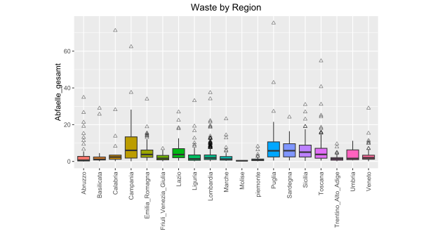
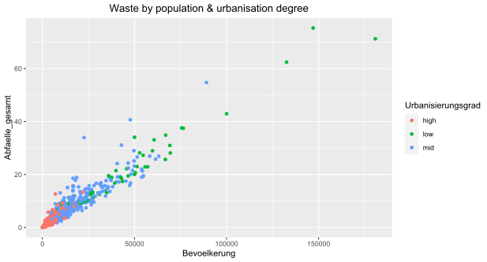

# Derivation of Waste Management Profiles (*WIP*)

## Exploratory Data Analysis
Get an overview of what the data set is about.
```{r}
wm_df <- load2("data/waste_management.RData")
skimr::skim(wm_df)
wm_df %>% complete.cases() %>% sum()
```
There are quite a lot of missing values. Omitting all of them would mean a loss of more than 50 % of the data.
Create some plots to enhance the understanding of the data set:
```{r}
wm_df %>% na.omit %>% 
  ggplot(aes(x=Region, y=Abfaelle_gesamt)) +
  geom_boxplot(aes(fill = Region), outlier.shape = 2,
               outlier.colour = "black",
               outlier.alpha = .5) +
  theme(aspect.ratio = 1) +
  theme(axis.title.x = element_blank(),
        axis.text.x = element_text(angle = 90, vjust = 0.5, hjust=1),
        legend.position = "none")
```

<p align = "center">
  <picture>
    
  </picture>
</p>


A lot of outliers in total amounts of waste per community. I am going to take care of them later. Til then they will be hidden, so other values appear less compressed.

```{r}
wm_df %>% na.omit %>% 
  ggplot(aes(x=Region, y=Abfaelle_gesamt)) +
  geom_boxplot(aes(fill = Region), outlier.shape = NA) +
  theme(aspect.ratio = 1) +
  coord_flip() +
  coord_fixed(ylim = c(0, 29)) +
  theme(axis.title.x = element_blank(),
        axis.text.x = element_text(angle = 90, vjust = 0.5, hjust=1),
        legend.position = "none")
```
<p align = "center">
  <picture>
    
  </picture>
</p>

```{r}
wm_df %>% na.omit %>% 
  mutate(Geologischer_Indikator = ifelse(Geologischer_Indikator == 1, "South", ifelse(Geologischer_Indikator == 2, "Middle", "North"))) %>% 
  ggplot(aes(x=Geologischer_Indikator, y=Abfaelle_gesamt)) +
  geom_boxplot(aes(fill = Geologischer_Indikator), outlier.shape = NA) +
  coord_cartesian(ylim = quantile(wm_df$Abfaelle_gesamt, c(0, 0.97))) +
  theme(axis.title.x = element_blank(),
        axis.text.x = element_blank())
```
<p align = "center">
  <picture>
    
  </picture>
</p>

```{r}
wm_df %>%
  na.omit %>%
  mutate(Urbanisierungsgrad =
           ifelse(Urbanisierungsgrad == 1, "low",
                  ifelse(Urbanisierungsgrad == 2, "mid",
                         "high")
  )) %>% 
  ggplot(aes(y=Abfaelle_gesamt)) +
  geom_point(aes(x=Bevoelkerung, colour = Urbanisierungsgrad))
```
<p align = "center">
  <picture>
    
  </picture>
</p>

```{r}
wm_df %>% na.omit %>% 
  mutate(Urbanisierungsgrad = ifelse(Urbanisierungsgrad == 1, "Urbanization low",
                                     ifelse(Urbanisierungsgrad == 3, "Urbanization high",
                                            "Urbanization mid"))) %>% 
  ggplot(aes(x=Urbanisierungsgrad, y=Abfaelle_gesamt)) +
  stat_summary(aes(group = Urbanisierungsgrad, fill = Urbanisierungsgrad), fun = mean, geom = "bar") +
  labs(y = "mean(Abfaelle_gesamt)") +
  theme(axis.title.x = element_blank(),
        axis.text.x = element_blank())
```
<p align = "center">
  <picture>
    
  </picture>
</p>


Inspecting missing values within the waste sorting related columns:

```{r}
sapply(wm_df[,16:25],
       function(y) sum(length(which(is.na(y))))) %>%
  tibble(Column = names(.),
         NA_Count = .)
```

```{r}
Sort_NAs <- c()
for (i in 17:25) {
  nas_t <- which(is.na(wm_df[i]))
  Sort_NAs <- c(Sort_NAs, nas_t)
}

Sort_NAs_table <- Sort_NAs %>% table %>% sort(decreasing = T)
Sort_NAs_table[1:5] %>% names %>% as.numeric -> t

wm_df[t,16:25]
```

Looks like the sum of the values present in these waste sorting columns equals
the value in Sortierungsgrad. Imputing any values here would completely destroy the logic behind these columns. I would argue that dropping all these values is a viable option. However, one could also say that replacing these NAs with zeros instead might work out as well. The latter option is the one I chose.

## Dimension Reduction

Within the data set there are dimensions that hold no value when it comes to any analyses. "ID" is a unique identifier, "Gemeinde" the name of a community, "Strassen" contains more than 10 % missing values, "Region" and "Provinz" contain too many unique values that would complicate the process a lot. Also the importance of the information they hold is questionable.

```{r}
cols_to_exclude <- c("ID", "Gemeinde", "Strassen", "Region", "Provinz")
```

A vector containing the names of the columns mentioned is created.
A recipe from the *tidyverse* is used to remove these dimensions, replace missing values via bag imputation and replace outliers in numeric dimension with the IQR limits of their individual column and replace the remaining nominal columns with dummy variables.

Note: *step_impute_constant()* and *step_outliers_iqr_to_limits()* are function from the *steffanossaR* package found at https://github.com/steffanossa/steffanossaR.

```{r}
recipe_prep <- recipe(~., data = wm_df) %>% 
  step_rm(all_of(cols_to_exclude)) %>% 
  step_impute_constant(contains("Sort_"), constant = 0) %>% 
  step_impute_bag(all_numeric()) %>% 
  step_outliers_iqr_to_limits(all_numeric()) %>% 
  step_other(all_nominal(), threshold = .001, other = NA) %>% 
  step_naomit(everything(), skip = T) %>% 
  step_dummy(all_nominal()) %>% 
  step_zv(everything())
```
```{r}
#| include: false
set.seed(187)
wm_df_prepped <- recipe_prep %>% prep %>% bake(new_data = NULL)
```

### Principal Components Analysis (PCA)

A PCA is used to reduce the number of variables by finding principal components of the data, which are new and uncorrelated variables that can explain the most variance in the original data.

First, the Bartlett test is done.
The Bartlett test verifies the null hypothesis that the correlation matrix is equal to the identity matrix, meaning that the variables of a given data set are uncorrelated. If the resulting value is below .05, the null hypothesis is rejected and it is concluded, that the variables are correlated.

(Reference: https://www.itl.nist.gov/div898/handbook/eda/section3/eda357.htm)

```{r}
psych::cortest.bartlett(cor(wm_df_prepped), n = 100)
```

The value is way below 0.05, there is correlation between the dimensions of the data set.

Next, the Kaiser-Mayer-Olkin Criterion (KMO) is looked at.
The KMO measures the adequacy of a dataset for factor analysis.
It ranges from 0 to 1, where a higher value indicates higher suitability.
A value above .6 is generally considered to be the threshold.
However, some sources also consider .5 to be acceptable.

(Reference: https://www.empirical-methods.hslu.ch/entscheidbaum/interdependenzanalyse/reduktion-der-variablen/faktoranalyse/)
```{r}
psych::KMO(wm_df_prepped)$MSA
```

0.559 is not very good but I will consider this acceptable.
Now the PCA can be executed.

```{r}
wm_df_pca <- 
  wm_df_prepped %>% 
  prcomp(scale. = T,
         center = T)
wm_df_pca %>% summary()
```

Taking a look at the first 15 principal components (PC) and the percentage of variance they explain.

```{r}
wm_df_pca %>% factoextra::fviz_eig(ncp = 15,
                                   addlabels = T)
```

<p align = "center">
  <picture>
    
  </picture>
</p>

The *elbow method* would suggest using three PCs. The cumulative variance of 49.942 % when taking only three is too little to result in useful outcomes.

Another method of evaluating the number of PCs to keep is the *Kaiser Criterion* which states that factors with an eigenvalue above 1 are considered important and should be retained. An eigenvalue above 1 means its factor explains more variance than a single variable would.

```{r}
factoextra::get_eig(wm_df_pca) %>%
  filter(eigenvalue > 1) %>%
  nrow()
```

7 factors possess eigenvalues above 1 with a cumulative variance of 69.424 %.
A third approach is *Horn's Method*.
Here random data sets with equal size (columns and rows) as the original data set are generated and then a factor analysis is performed on each of them. The retained number of factors are then compared. The idea is that if the number of factors kept in the original data set is similar to the number of factors kept in the random sets, the factors of the original data set are considered not meaningful. If the number of factors of the original data set is larger than the number of factors in the random sets, the factors in the original data set are considered meaningful.

```{r}
wm_df_prepped %>% paran::paran()
```

*Horn's Method* suggests a number of 6 PCs to keep.
I chose to keep 7 with approximately 70 % cumulative variance.
Next, we take a look at the contributions of the original variables to each new PC.

```{r}
n_PCs <- 7
for (i in 1:n_PCs) {
  factoextra::fviz_contrib(wm_df_pca, "var", axes = i) %>% print
}
```

<p align = "center">
  <picture>
    
  </picture>
    <picture>
    
  </picture>
    <picture>
    
  </picture>
    <picture>
    
  </picture>
    <picture>
    
  </picture>
    <picture>
    
  </picture>
    <picture>
    
  </picture>
</p>


The *psych* package comes with a function that can illustrate the contribution of each original variable to the PCs in one plot.

```{r}
wm_df_prepped %>%
  psych::principal(nfactors = n_PCs) %>%
  psych::fa.diagram()
```

A new data set is created based on the new dimensions.

```{r}
wm_df_transformed_pca <- as.data.frame(-wm_df_pca$x[,1:n_PCs])
```

### Factor Analysis (FA)
Like the PCA a factor analysis can be used to reduce the dimensions of a data  set.
However, while the PCA creates uncorrelated variables the FA identifies underlying latent factors that explain the relationships among the original variables in the data set.
The factors the FA puts out might be correlated, so a rotation can be used in make these factors as uncorrelated as possible.

First, a vector containing all rotation methods is created. Then we iterate over each of them using a for-loop.

```{r}
rot_meth <- c("varimax", "quartimax", "equamax", "oblimin", "oblimax", "promax")

for (rm in rot_meth) {
  invisible(
    readline(
      prompt=paste0("[enter] to show next rotation result")))
  cat("Factor Analysis results. Rotation method: ", rm)
  wm_df_prepped %>% factanal(factors = n_PCs,
                             rotation = rm,
                             lower = 0.01) %>% 
    print
}
```

58.3 % is the maximum amount of cumulative variance with 7 factors. Approximately 20 % less than what the PCA yielded. Therefore PCA will be used.

## Cluster Analysis

To assess the clustering tendency of a data set the *Hopkins Statistic* can be used. It measures the probability that a given data set was generated by a uniform data distribution. The higher the resulting value the better the clustering tendency. Values range from 0 to 1.

```{r}
wm_df_transformed_pca %>%
  get_clust_tendency(n = nrow(wm_df_transformed_pca) - 1, graph = F)
```

~ 0.779 is quite good.

### Hierarchical Clustering: Agglomerative Methods

Clustering can be done with different approaches.
Agglomerative methods start with a cluster containing a single observation, adding more and more observations successively.
First, a distance matrix and then clusters are created. For both steps there are multiple methods of creation.

```{r}
dist_meth <- c("euclidean", "maximum", "manhattan", "canberra", "minkowski")
clust_meth <- c("single", "complete", "average", "mcquitty", "median", "centroid", "ward.D2")
#' *...*
```

The combination of *manhattan* and *ward.D2* looks most promising.

```{r}
hclust_a <- 
  dist(scale(wm_df_transformed_pca), 
       method = "canberra") %>% 
  hclust(method = "ward.D2")
ggdendrogram(hclust_a, leaf_labels = F, labels = F) +
  labs(title = paste0("Distance: Canberra", "\nCluster: ward.D2"))
```

3 or maybe for clusters seem to be viable options.
Microsoft Excel can be used to comfortably compare clusters for profiling and help determining the number of clusters to choose.

*EXCEL SCREENSHOT OR STH*
