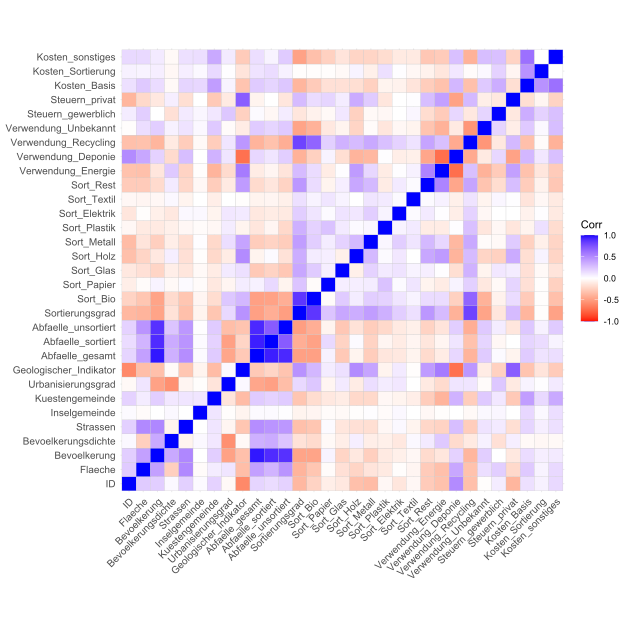

# Derivation of Waste Management Profiles (*WIP*)

## Disclaimer
Most recent code can be found below. *.R* files might be outdated.

## Todos:
- [ ] references: ~bartlett test~, ~kmo~, pca, fa, ~hopkins~
- [x] clustering: ~diana~, ~k-means~, ~daisy~
- [ ] profiling
- [ ] recommendations

## Context
Although only about 15% of all waste within the EU is generated as municipal waste[^bignote], the absolute figures pose a major problem for municipalities, waste management companies and the environment. 225.7 million tonnes of municipal waste were collected in the EU in 2020, of which only 68 million tonnes were directly recycled, with the remainder going into long-term landfill or being incinerated for energy generation. In view of the climate-damaging landfill gases produced during storage or CO2 emissions during incineration, combined with the problem of the large amount of space required, the EU's goal is to constantly optimise its waste management. This is intended to promote the production of less waste, a stronger circular economy and the economic efficiency of waste management.
In the context of this optimisation, we want to work out a status quo of municipal waste management in Italian municipalities, on which subsequent optimisation projects can build. For this purpose, we base our work on a data set on the waste management of a total of 4341 Italian municipalities. With the help of these data, we are to draw up profiles of the municipalities, which we can cluster them with regard to their descriptive characteristics, in particular the key figures of waste management, but also geographical and economic factors.

<details>
  <summary>(<i>click to show/hide the characteristics of the data set</i>)</summary>
  <!-- have to be followed by an empty line! -->

|	ID	|	Column name	|	Explanation	|
|:---|:---|:---|
|	1	|	ID	|	Unique identification number of the municipality.	|
|	2	|	Region	|	Region in which the municipality is located.	|
|	3	|	Provinz	|	Province in which the municipality is located.	|
|	4	|	Gemeinde	|	Name of the municipality.	|
|	5	|	Flaeche	|	Area of the municipality in km².	|
|	6	|	Bevoelkerung	|	Population of the municipality.	|
|	7	|	Bevoelkerungsdichte	|	Population of the municipality per km².	|
|	8	|	Strassen	|	Total length of all roads in the municipality in km.	|
|	9	|	Invelgemeinde	|	Indicator whether municipality is on an island (1 yes, 0 no).	|
|	10	|	Kuestengemeinde	|	Indicator whether municipality is on the coast (1 yes, 0 no).	|
|	11	|	Urbanisierungsgrad	|	Degree of municipality urbanisation (1 low, 3 high).	|
|	12	|	Geologischer_Indikator  |	Geological location of the municipality (1 south, 2 central, 3 north).	|
|	13	|	Abfaelle_gesamt	|	Total amount of municipal waste in kilotonnes (kt).	|
|	14	|	Abfaelle_sortiert	|	Municipal waste sorted in kilotonnes (kt).	|
|	15	|	Abfaelle_unsortiert	|	Unsorted municipal waste in kilotonnes (kt).	|
|	16	|	Sortierungsgrad	|	Percentage of sorted municipal waste in total.	|
|	17	|	Sort_Bio  | Proportion of organic waste among the sorted.	|
|	18	|	Sort_Papier	|	Proportion of paper waste sorted.	|
|	19	|	Sort_Glas	|	Percentage of glass waste sorted.	|
|	20	|	Sort_Holz	|	Proportion of wood waste among those sorted.	|
|	21	|	Sort_Metall	|	Proportion of metal waste among the sorted.	|
|	22	|	Sort_Plastik	|	Proportion of plastic waste among the sorted.	|
| 23  | Sort_Elektrik | Proportion of electrical waste among those sorted.  |
| 24  | Sort__Textil |  Proportion of textile waste among those sorted. |
| 25  | Sort_Rest | Proportion of residual waste among those sorted.  |
| 26  | Verwendung_Energie |  Proportion of waste that is used for energy recovery. |
| 27  | Verwendung_Deponie |  Proportion of waste that is landfilled. |
| 28  | Verwendung_Recycling |  Proportion of waste that is recycled. |
| 29  | Verwendung_Unbekannt |  Proportion of waste whose further use is unknown. |
| 30  | Steuern_gewerblich |  Per capita Tax revenue from commercial sources. |
| 31  | Steuern_privat |  Per capita tax revenue from private sources.  |
| 32  | Kosten_Basis |  Per capita basic costs of waste management. |
| 33  | Kosten_Sortierung | Per capita sorting costs of waste management companies. |
| 34  | Kosten_sonstiges |  Per capita other costs of waste management.  |
| 35  | Gebuehrenregelung | Waste fee regulation of the municipality. |
| 36  | Region_PAYT | Indicator whether region offers PAYT (pay as you throw).  |
</details>


[^bignote]: Municipal waste is all waste collected and treated by or for municipalities. It includes waste from households
including bulky waste, similar waste from trade and commerce, office buildings, institutions and small businesses, as well as yard and garden waste, street sweepings and the contents of waste containers.
yard and garden waste, street sweepings and the contents of waste containers. The definition includes waste from municipal
sewage networks and their treatment as well as waste from construction and demolition work.

## Exploratory Data Analysis
Get an overview of the data set.
```r
wm_df <- load2("data/waste_management.RData")
skimr::skim(wm_df)
#wm_df %>% complete.cases() %>% sum()
```
<details>
  <summary>(<i>click to show/hide console output</i>)</summary>
  <!-- have to be followed by an empty line! -->

```
── Data Summary ────────────────────────
                           Values
Name                       wm_df 
Number of rows             4341  
Number of columns          36    
_______________________          
Column type frequency:           
  character                5     
  numeric                  31    
________________________         
Group variables            None  
── Variable type: character ────────────────────────────────────────────────────────────────────────────────────────────────────
  skim_variable     n_missing complete_rate min max empty n_unique whitespace
1 Region                    0         1       5  21     0       20          0
2 Provinz                   0         1       4  21     0      102          0
3 Gemeinde                  6         0.999   2  60     0     4333          0
4 Gebuehrenregelung         0         1       4   8     0        2          0
5 Region_PAYT               0         1       2   4     0        2          0

── Variable type: numeric ──────────────────────────────────────────────────────────────────────────────────────────────────────
   skim_variable          n_missing complete_rate        mean         sd      p0      p25      p50      p75      p100 hist 
 1 ID                             0         1     47470.      30090.     1272    18135    42015    70049     111107   ▇▃▅▃▃
 2 Flaeche                        6         0.999    41.0        56.8       0.12    10.8     22.7     47.5     1287.  ▇▁▁▁▁
 3 Bevoelkerung                   0         1     10204.      53426.       34     1579     3535     8199    2617175   ▇▁▁▁▁
 4 Bevoelkerungsdichte            6         0.999   405.        771.        2.48    62.6    151.     399.     12123.  ▇▁▁▁▁
 5 Strassen                     443         0.898   102.        310.        1       25       51      105      14970   ▇▁▁▁▁
 6 Inselgemeinde                  6         0.999     0.00507     0.0711    0        0        0        0          1   ▇▁▁▁▁
 7 Kuestengemeinde                6         0.999     0.168       0.374     0        0        0        0          1   ▇▁▁▁▂
 8 Urbanisierungsgrad             6         0.999     2.49        0.595     1        2        3        3          3   ▁▁▆▁▇
 9 Geologischer_Indikator       285         0.934     2.29        0.888     1        1        3        3          3   ▃▁▂▁▇
10 Abfaelle_gesamt                0         1         5.31       32.5       0.02     0.61     1.52     3.95    1692.  ▇▁▁▁▁
11 Abfaelle_sortiert              0         1         3.25       15.6       0        0.37     1.04     2.73     765.  ▇▁▁▁▁
12 Abfaelle_unsortiert            0         1         2.04       17.6       0.01     0.18     0.41     1.06     927.  ▇▁▁▁▁
13 Sortierungsgrad                0         1        60.1        19.8       0       44.3     64.3     76.5       97.5 ▁▃▅▇▅
14 Sort_Bio                     511         0.882    22.3        12.7       0.01    11.1     25.0     31.8       61.6 ▅▅▇▂▁
15 Sort_Papier                   25         0.994    11.0         3.88      0        8.66    10.9     13.1       45.3 ▃▇▁▁▁
16 Sort_Glas                     33         0.992     9.41        3.71      0        7.15     9.1     11.3       39.8 ▅▇▁▁▁
17 Sort_Holz                   1095         0.748     4.11        2.72      0        2.08     4.02     5.71      25.1 ▇▃▁▁▁
18 Sort_Metall                  246         0.943     1.76        1.35      0        0.88     1.54     2.35      20.7 ▇▁▁▁▁
19 Sort_Plastik                  39         0.991     6.11        3.26      0        4.13     5.79     7.55      31.6 ▇▆▁▁▁
20 Sort_Elektrik                314         0.928     1.23        0.821     0        0.78     1.18     1.57      18.0 ▇▁▁▁▁
21 Sort_Textil                 1013         0.767     0.757       0.688     0        0.35     0.63     0.99      10.6 ▇▁▁▁▁
22 Sort_Rest                    136         0.969     7.94        5.15      0.03     3.96     7.13    11.1       37.2 ▇▆▂▁▁
23 Verwendung_Energie             0         1        20.3        15.7       0        5.63    18.5     38.5       55.1 ▇▃▂▇▁
24 Verwendung_Deponie             0         1        17.9        19.5       0        4.55    11.3     31.5       76.7 ▇▁▂▁▁
25 Verwendung_Recycling           0         1        41.3        12.8       2.35    32.7     43.2     51.6       76.7 ▁▅▇▇▁
26 Verwendung_Unbekannt           0         1        20.5        17.8       0        5.21    17.8     31.0       97.4 ▇▅▂▁▁
27 Steuern_gewerblich           386         0.911 16565.      14132.     4180.    9080.   12465.   19413.    377492.  ▇▁▁▁▁
28 Steuern_privat               285         0.934 13211.       3649.     2606.   10162.   13668.   15759.     35770.  ▂▇▃▁▁
29 Kosten_Basis                   0         1       154.         76.1      25.7    108.     137.     179.       977.  ▇▁▁▁▁
30 Kosten_Sortierung             67         0.985    52.7        33.1       3.39    31.3     48.9     66.4      582.  ▇▁▁▁▁
31 Kosten_sonstiges              52         0.988    54.2        43.2       4.27    27.3     41.7     66.5      670.  ▇▁▁▁▁
```
</details>

There are quite a lot of missing values. Omitting all of them would mean a loss of more than 50 % of the data.
Create some plots to enhance the understanding of the data set:
```r
wm_df %>% na.omit %>% 
  ggplot(aes(x=Region, y=Abfaelle_gesamt)) +
  ggtitle("Waste by Region") +
  geom_boxplot(aes(fill = Region), outlier.shape = 2,
               outlier.colour = "black",
               outlier.alpha = .5) +
  theme(aspect.ratio = 0.5) +
  theme(axis.title.x = element_blank(),
        axis.text.x = element_text(angle = 90, vjust = 0.5, hjust=1),
        legend.position = "none",
        plot.title = element_text(hjust = 0.5))
```

<p align = "center">
  <picture>
    
  </picture>
</p>


A lot of outliers in total amounts of waste per community. I am going to take care of them later. Til then they will be hidden, so other values appear less compressed.

```r
wm_df %>% na.omit %>% 
  ggplot(aes(x=Region, y=Abfaelle_gesamt)) +
  ggtitle("Waste by Region") +
  geom_boxplot(aes(fill = Region), outlier.shape = NA) +
  theme(aspect.ratio = 0.5) +
  coord_flip() +
  coord_fixed(ylim = c(0, 29)) +
  theme(axis.title.x = element_blank(),
        axis.text.x = element_text(angle = 90, vjust = 0.5, hjust=1),
        legend.position = "none",
        plot.title = element_text(hjust = 0.5))
```
<p align = "center">
  <picture>
    
  </picture>
</p>

```r
wm_df %>% na.omit %>% 
  mutate(Geologischer_Indikator = ifelse(Geologischer_Indikator == 1, "South", ifelse(Geologischer_Indikator == 2, "Middle", "North"))) %>% 
  ggplot(aes(x=Geologischer_Indikator, y=Abfaelle_gesamt)) +
  ggtitle("Waste by geological location") +
  geom_boxplot(aes(fill = Geologischer_Indikator), outlier.shape = NA) +
  coord_cartesian(ylim = quantile(wm_df$Abfaelle_gesamt, c(0, 0.97))) +
  theme(axis.title.x = element_blank(),
        axis.text.x = element_blank(),
        plot.title = element_text(hjust = 0.5))
```
<p align = "center">
  <picture>
    
  </picture>
</p>

```r
wm_df %>%
  na.omit %>%
  mutate(Urbanisierungsgrad =
           ifelse(Urbanisierungsgrad == 1, "low",
                  ifelse(Urbanisierungsgrad == 2, "mid",
                         "high")
  )) %>% 
  ggplot(aes(y=Abfaelle_gesamt)) +
  ggtitle("Waste by population & urbanisation degree") +
  geom_point(aes(x=Bevoelkerung, colour = Urbanisierungsgrad)) +
  theme(plot.title = element_text(hjust = 0.5))
```
<p align = "center">
  <picture>
    
  </picture>
</p>

```r
wm_df %>% na.omit %>% 
  mutate(Urbanisierungsgrad = ifelse(Urbanisierungsgrad == 1, "Urbanization low",
                                     ifelse(Urbanisierungsgrad == 3, "Urbanization high",
                                            "Urbanization mid"))) %>% 
  ggplot(aes(x=Urbanisierungsgrad, y=Abfaelle_gesamt)) +
  ggtitle("Mean waste by urbanisation degree") +
  stat_summary(aes(group = Urbanisierungsgrad, fill = Urbanisierungsgrad), fun = mean, geom = "bar") +
  labs(y = "mean(Abfaelle_gesamt)") +
  theme(axis.title.x = element_blank(),
        axis.text.x = element_blank(),
        plot.title = element_text(hjust = 0.5))
```
<p align = "center">
  <picture>
    
  </picture>
</p>

Taking a look at correlations

```r
wm_df %>% 
  select_if(is.numeric) %>% 
  na.omit %>% 
  cor(use = "pairwise.complete.obs") %>% 
  ggcorrplot::ggcorrplot(lab = F,
                         colors = c("red", "white", "blue"),
                         tl.cex = 10)
```
<p align = "center">
  <picture>
    
  </picture>
</p>


Inspecting missing values within the waste sorting related columns:

```r
sapply(wm_df[,16:25],
       function(y) sum(length(which(is.na(y))))) %>%
  tibble(Column = names(.),
         NA_Count = .)
```
<details>
  <summary>(<i>click to show/hide console output</i>)</summary>
  <!-- have to be followed by an empty line! -->

```
# A tibble: 10 × 2
   Column          NA_Count
   <chr>              <int>
 1 Sortierungsgrad        0
 2 Sort_Bio             511
 3 Sort_Papier           25
 4 Sort_Glas             33
 5 Sort_Holz           1095
 6 Sort_Metall          246
 7 Sort_Plastik          39
 8 Sort_Elektrik        314
 9 Sort_Textil         1013
10 Sort_Rest            136
```
</details>

```r
Sort_NAs <- c()
for (i in 17:25) {
  nas_t <- which(is.na(wm_df[i]))
  Sort_NAs <- c(Sort_NAs, nas_t)
}

Sort_NAs_table <- Sort_NAs %>% table %>% sort(decreasing = T)
Sort_NAs_table[1:5] %>% names %>% as.numeric -> t

wm_df[t,16:25]
```
<details>
  <summary>(<i>click to show/hide console output</i>)</summary>
  <!-- have to be followed by an empty line! -->

```
     Sortierungsgrad Sort_Bio Sort_Papier Sort_Glas Sort_Holz Sort_Metall Sort_Plastik Sort_Elektrik Sort_Textil Sort_Rest
429             0.72       NA        0.72        NA        NA          NA           NA            NA          NA        NA
3572            0.70       NA          NA        NA        NA          NA           NA           0.7          NA        NA
4175            0.00       NA          NA        NA        NA          NA           NA           0.0          NA        NA
3777           59.32       NA          NA     39.84        NA          NA           NA            NA          NA     19.48
4017            1.87       NA          NA        NA        NA          NA         0.62            NA          NA      1.25
```
</details>

Looks like the sum of the values present in these waste sorting columns equals
the value in *Sortierungsgrad*. Imputing any values here would completely destroy the logic behind these columns. I would argue that dropping all these values is a viable option. However, one could also say that replacing these NAs with zeros instead might work out as well. The latter option is the one I chose.

## Dimension Reduction

Within the data set there are dimensions that hold no value when it comes to any analyses. *ID* is a unique identifier, *Gemeinde* the name of a community, *Strassen* contains more than 10 % missing values, *Region* and *Provinz* contain too many unique values that would complicate the process a lot. Also the importance of the information they hold is questionable.

```r
cols_to_exclude <- c("ID",
                     "Gemeinde",
                     "Strassen",
                     "Region",
                     "Provinz")
```

A vector containing the names of the columns mentioned is created.
A recipe from the *tidyverse* is used to remove these dimensions, replace missing values via bag imputation and replace outliers in numeric dimension with the IQR limits of their individual column and replace the remaining nominal columns with dummy variables.

Note: *step_impute_constant()* and *step_outliers_iqr_to_limits()* are functions from the *steffanossaR* package found at https://github.com/steffanossa/steffanossaR.

```r
recipe_prep <- recipe(~., data = wm_df) %>% 
  step_rm(all_of(cols_to_exclude)) %>% 
  step_impute_constant(contains("Sort_"), constant = 0) %>% 
  step_impute_bag(all_numeric()) %>% 
  step_outliers_iqr_to_limits(all_numeric(), -ends_with("gemeinde") %>% 
  step_other(all_nominal(), threshold = .001, other = NA) %>% 
  step_naomit(everything(), skip = T) %>% 
  step_dummy(all_nominal()) %>% 
  step_zv(everything())
```

```r
#| include: false
set.seed(187)
wm_df_prepped <-
  recipe_prep %>%
  prep %>%
  bake(new_data = NULL)
```

### Principal Components Analysis (PCA)

A PCA is used to reduce the number of variables by finding principal components of the data, which are new and uncorrelated variables that can explain the most variance in the original data.

First, the *Bartlett Test* is done.
The Bartlett test verifies the null hypothesis that the correlation matrix is equal to the identity matrix, meaning that the variables of a given data set are uncorrelated. If the resulting value is below .05, the null hypothesis is rejected and it is concluded, that the variables are correlated[^2].

[^2]: Reference: https://www.itl.nist.gov/div898/handbook/eda/section3/eda357.htm

```r
psych::cortest.bartlett(cor(wm_df_prepped), n = 100)$p.value
```
<details>
  <summary>(<i>click to show/hide console output</i>)</summary>
  <!-- have to be followed by an empty line! -->

```
[1] 3.075839e-286
```
</details>

The p-value is way below 0.05, there is correlation between the dimensions of the data set.

Next, the *Kaiser-Mayer-Olkin Criterion* (KMO) is looked at.
The KMO measures the adequacy of a dataset for factor analysis.
It ranges from 0 to 1, where a higher value indicates higher suitability.
A value above .6 is generally considered to be the threshold.
However, some sources also consider .5 to be acceptable[^3].

[^3]: Reference: https://www.empirical-methods.hslu.ch/entscheidbaum/interdependenzanalyse/reduktion-der-variablen/faktoranalyse/
```r
psych::KMO(wm_df_prepped)$MSA
```
<details>
  <summary>(<i>click to show/hide console output</i>)</summary>
  <!-- have to be followed by an empty line! -->

```
[1] 0.5681499
```
</details>

\~0.57 is not very good but I will consider this acceptable.
Now the PCA can be executed.

```r
wm_df_pca <- 
  wm_df_prepped %>% 
  prcomp(scale. = T,
         center = T)
wm_df_pca %>%
  summary()
```
<details>
  <summary>(<i>click to show/hide console output</i>)</summary>
  <!-- have to be followed by an empty line! -->

```
Importance of components:
                          PC1      PC2     PC3     PC4     PC5     PC6     PC7     PC8
Standard deviation     2.5701   2.3601  1.5934 1.35156 1.25891 1.15567 1.03789 1.02265
Proportion of Variance 0.2131   0.1797  0.0819 0.05893 0.05112 0.04308 0.03475 0.03374
Cumulative Proportion  0.2131   0.3928  0.4747 0.53359 0.58471 0.62780 0.66255 0.69628
                           PC9    PC10    PC11    PC12    PC13    PC14    PC15    PC16
Standard deviation     0.96964 0.95687 0.91417 0.88252 0.85881 0.80217 0.79484 0.76324
Proportion of Variance 0.03033 0.02954 0.02696 0.02512 0.02379 0.02076 0.02038 0.01879
Cumulative Proportion  0.72661 0.75615 0.78310 0.80823 0.83202 0.85278 0.87316 0.89195
                          PC17    PC18    PC19    PC20    PC21    PC22    PC23    PC24
Standard deviation     0.74113 0.69080 0.64876 0.60780 0.55877  0.5454 0.47311 0.45339
Proportion of Variance 0.01772 0.01539 0.01358 0.01192 0.01007  0.0096 0.00722 0.00663
Cumulative Proportion  0.90967 0.92506 0.93864 0.95055 0.96063  0.9702 0.97744 0.98407
                          PC25    PC26    PC27    PC28    PC29    PC30    PC31
Standard deviation     0.43197 0.38751 0.32419 0.17301 0.09742 0.08771 0.06887
Proportion of Variance 0.00602 0.00484 0.00339 0.00097 0.00031 0.00025 0.00015
Cumulative Proportion  0.99009 0.99494 0.99833 0.99929 0.99960 0.99985 1.00000
```
</details>

Taking a look at the first 15 principal components (PC) and the percentage of variance they explain.

```r
wm_df_pca %>%
factoextra::fviz_eig(ncp = 15,
                     addlabels = T)
```

<p align = "center">
  <picture>
    
  </picture>
</p>

The *elbow method* would suggest using three PCs. The cumulative variance of 49.942 % when taking only three is too little to result in useful outcomes.

Another method of evaluating the number of PCs to keep is the *Kaiser Criterion* which states that factors with an eigenvalue above 1 are considered important and should be retained. An eigenvalue above 1 means its factor explains more variance than a single variable would.

```r
factoextra::get_eig(wm_df_pca) %>%
  filter(eigenvalue > 1)
```
<details>
  <summary>(<i>click to show/hide console output</i>)</summary>
  <!-- have to be followed by an empty line! -->

```
      eigenvalue variance.percent cumulative.variance.percent
Dim.1	  6.604434	      21.304627                    21.30463
Dim.2   5.571090      	17.971259                    39.27589
Dim.3	  2.533845	       8.173692	                   47.44958
Dim.4 	1.824394      	 5.885141	                   53.33472
Dim.5	  1.586462	       5.117619	                   58.45234
Dim.6	  1.339441	       4.320776	                   62.77311
Dim.7	  1.076469	       3.472482            	       66.24560
Dim.8	  1.043998	       3.367737                    69.61333
```
</details>

8 factors possess eigenvalues above 1 with a cumulative variance of \~69.61 %.

```r
get_eig(wm_df_pca)[1:15,] %>% 
  ggplot(aes(y=eigenvalue, x=1:15)) +
  ggtitle("Eigenvalue by Component") +
  labs(x = "Component",
       y = "Eigenvalue") +
  geom_line() +
  geom_point(col = "blue") +
  scale_x_continuous(breaks = 1:15) +
  geom_hline(yintercept = 1, linetype = "dashed") +
  theme(plot.title = element_text(hjust = 0.5))
```

<p align = "center">
  <picture>
    
  </picture>
</p>

A third approach is *Horn's Method*.
Here random data sets with equal size (columns and rows) as the original data set are generated and then a factor analysis is performed on each of them. The retained number of factors are then compared. The idea is that if the number of factors kept in the original data set is similar to the number of factors kept in the random sets, the factors of the original data set are considered not meaningful. If the number of factors of the original data set is larger than the number of factors in the random sets, the factors in the original data set are considered meaningful[^4].

[^4]: Reference: doi:10.1007/bf02289447

```r
set.seed(187)
wm_df_prepped %>%
     paran::paran()
```
<details>
  <summary>(<i>click to show/hide console output</i>)</summary>
  <!-- have to be followed by an empty line! -->

```
Results of Horn's Parallel Analysis for component retention
930 iterations, using the mean estimate

-------------------------------------------------- 
Component   Adjusted    Unadjusted    Estimated 
            Eigenvalue  Eigenvalue    Bias 
-------------------------------------------------- 
1           6.446948    6.604434      0.157485
2           5.432912    5.571090      0.138178
3           2.410785    2.533844      0.123058
4           1.713787    1.824393      0.110606
5           1.487574    1.586461      0.098887
6           1.251387    1.339440      0.088052
--------------------------------------------------

Adjusted eigenvalues > 1 indicate dimensions to retain.
(6 components retained)
```
</details>

*Horn's Method* suggests a number of 6 PCs to keep.
I chose to keep 8 with approximately 70 % cumulative variance.
Next, we take a look at the contributions of the original variables to each new PC.

```r
n_PCs <- 8
for (i in 1:n_PCs) {
  factoextra::fviz_contrib(wm_df_pca, "var", axes = i)
  %>% print
}
```

<p align = "center">
  <picture>
    
  </picture>
    <picture>
    
  </picture>
    <picture>
    
  </picture>
    <picture>
    
  </picture>
    <picture>
    
  </picture>
    <picture>
    
  </picture>
    <picture>
    
  </picture>
</p>


The *psych* package comes with a function that can illustrate the contribution of each original variable to the PCs in one plot.

```r
wm_df_prepped %>%
  psych::principal(nfactors = n_PCs) %>%
  psych::fa.diagram()
```
<details>
  <summary>(<i>click to show/hide</i>)</summary>
  <!-- have to be followed by an empty line! -->

<p align = "center">
  <picture>
    
  </picture>
</p>
</details>

A new data set is created based on the new dimensions.

```r
wm_df_transformed_pca <- as.data.frame(-wm_df_pca$x[,1:n_PCs])
```

### Factor Analysis (FA)
Like the PCA a factor analysis can be used to reduce the dimensions of a data  set.
However, while the PCA creates uncorrelated variables the FA identifies underlying latent factors that explain the relationships among the original variables in the data set.
The factors the FA puts out might be correlated, so a rotation can be used in make these factors as uncorrelated as possible.

First, a vector containing all rotation methods is created. Then we iterate over each of them using a for-loop.

```r
rot_meth <- c("varimax",
              "quartimax",
              "equamax",
              "oblimin",
              "promax")
max_cumvar <- 0
for (rm in rot_meth) {
  cat("Factor Analysis results. Rotation method: ", rm, "\n")
  res <- factanal(wm_df_prepped,
                  factors = n_PCs,
                  rotation = rm,
                  lower = 0.1) %>% 
    steffanossaR::ex_factanal()
  if (res[3,n_PCs] > max_cumvar & res[3,n_PCs] <= 1) {max_cumvar <- res[3,n_PCs]}
  print(res)
  cat("\n")
}
```

<details>
  <summary>(<i>click to show/hide console output</i>)</summary>
  <!-- have to be followed by an empty line! -->

```
Factor Analysis results. Rotation method:  varimax 
                 Factor1   Factor2    Factor3    Factor4    Factor5    Factor6    Factor7    Factor8
SS loadings    5.2625797 4.2328943 2.42322412 1.72548638 1.47297756 1.38332617 1.17507304 1.16537813
Proportion Var 0.1697606 0.1365450 0.07816852 0.05566085 0.04751541 0.04462342 0.03790558 0.03759284
Cumulative Var 0.1697606 0.3063056 0.38447413 0.44013498 0.48765039 0.53227381 0.57017939 0.60777224

Factor Analysis results. Rotation method:  quartimax 
                 Factor1   Factor2   Factor3    Factor4    Factor5    Factor6    Factor7    Factor8
SS loadings    5.2353602 4.2656853 3.2294537 1.63627033 1.33552917 1.32646255 1.07282139 0.73935672
Proportion Var 0.1688826 0.1376028 0.1041759 0.05278291 0.04308159 0.04278911 0.03460714 0.02385022
Cumulative Var 0.1688826 0.3064853 0.4106613 0.46344418 0.50652577 0.54931488 0.58392202 0.60777224

Factor Analysis results. Rotation method:  equamax 
                 Factor1    Factor2    Factor3    Factor4    Factor5    Factor6    Factor7    Factor8
SS loadings    4.3643577 2.96040826 2.56451685 1.98772753 1.90141196 1.90019869 1.72378435 1.43853404
Proportion Var 0.1407857 0.09549704 0.08272635 0.06412024 0.06133587 0.06129673 0.05560595 0.04640432
Cumulative Var 0.1407857 0.23628277 0.31900912 0.38312937 0.44446524 0.50576197 0.56136791 0.60777224

Factor Analysis results. Rotation method:  oblimin 
                 Factor1   Factor2    Factor3    Factor4  Factor5   Factor6    Factor7   Factor8
SS loadings    4.4381552 3.1541391 1.91135844 1.73505742 1.480126 1.4767935 1.35825449 1.3417234
Proportion Var 0.1431663 0.1017464 0.06165672 0.05596959 0.047746 0.0476385 0.04381466 0.0432814
Cumulative Var 0.1431663 0.2449127 0.30656944 0.36253904 0.410285 0.4579235 0.50173820 0.5450196

Factor Analysis results. Rotation method:  promax 
                Factor1   Factor2   Factor3   Factor4    Factor5    Factor6    Factor7    Factor8
SS loadings    5.009074 3.6273221 3.6242156 1.7168483 1.49714828 1.44777655 1.44589770 0.91053167
Proportion Var 0.161583 0.1170104 0.1169102 0.0553822 0.04829511 0.04670247 0.04664186 0.02937199
Cumulative Var 0.161583 0.2785934 0.3955036 0.4508858 0.49918090 0.54588337 0.59252523 0.62189722
```
</details>

62.22 % (promax rotation) is the maximum amount of cumulative variance with 8 factors. Approximately 10 % less than what the PCA yielded.
Additionally, the loading are ambiguous. PCA will be used.

## Cluster Analysis

To assess the clustering tendency of a data set the *Hopkins Statistic* can be used. It measures the probability that a given data set was generated by a uniform data distribution. The higher the resulting value the better the clustering tendency. Values range from 0 to 1[^5].

[^5]: Reference: https://www.datanovia.com/en/lessons/assessing-clustering-tendency/

```r
wm_df_transformed_pca %>%
  get_clust_tendency(n = nrow(wm_df_transformed_pca) - 1, graph = F)
```
<details>
  <summary>(<i>click to show/hide console output</i>)</summary>
  <!-- have to be followed by an empty line! -->

```
$hopkins_stat
[1] 0.8309369

$plot
NULL
```
</details>

\~ 0.8309 is quite good.

### Hierarchical Clustering: Agglomerative Methods

*Hierarchical Clustering* can be done with different approaches. *Agglomerative methods* start with every observation being considered a single-elementcluster. Then the two most similar clusters are combined into a new cluster. This is done until there is one cluster containing everything.
First, a distance matrix and then clusters are created. For both steps there are multiple methods of creation. Every combination is looped over and the results are saved into *.pdf* files which can be found in *doc/*.

```r
dist_meth <- c("euclidean",
               "maximum",
               "manhattan",
               "canberra",
               "minkowski")

daisy_meth <- c("euclidean",
                "manhattan",
                "gower")

hclust_meth <- c("single",
                 "complete",
                 "average",
                 "mcquitty",
                 "median",
                 "centroid",
                 "ward")

pdf("doc/dendro_dist_hclust.pdf", width = 16, height = 9)
for (dm in dist_meth) {
  for (cm in hclust_meth) {
    hdist <- dist(scale(wm_df_transformed_pca),
                  dm)
    hcl <- flashClust::flashClust(hdist, cm)
    plot(hcl,
         main = paste0("dist method: ", dm,
                       "\nclust method: ", cm),
         sub = NA,
         labels = FALSE)
  }
}
dev.off()

pdf("doc/dendro_daisy.pdf", width = 16, height = 9)
for (dm in daisy_meth) {
  for (cm in hclust_meth) {
    daisydist <- daisy(wm_df_transformed_pca,
                       metric = dm,
                       stand = TRUE)
    flashClust::flashClust(daisydist, cm) %>% 
      plot(main = paste0("dist method: ", dm,
                         "\nclust method: ", cm),
           sub = NA,
           labels = FALSE)
  }
}
dev.off()
```

The combination of *canberra* and *ward.D2* looks most promising.
     
```r
hclust_a <- 
  dist(scale(wm_df_transformed_pca), 
       method = "canberra") %>% 
  flashClust::flashClust(method = "ward")
 
hclust_a %>% plot(main = paste0("dist method: canberra",
                                "\nclust method: ward"),
                  sub = NA,
                  labels = FALSE)
```

<p align = "center">
  <picture>
    
  </picture>
</p>
     
A number of 2 to 7 clusters seem to be most viable. The results of clustering into 2 to 7 clusters will be saved as *.csv* file and later be used for profiling.
The results can be found in *doc/profiling_hclust_a.csv*

<details>
  <summary>(<i>click to show/hide code</i>)</summary>
  <!-- have to be followed by an empty line! -->

```r
for (i in 2:7) {
  wm_df_prepped_clust_a <-
    wm_df_prepped %>%
    mutate(Cluster_a = cutree(hclust_a, k = i))
  
  profiling_df <-
    wm_df_prepped_clust_a %>% 
    group_by(Cluster_a) %>% 
    mutate(n_island_municipalities = sum(Inselgemeinde),
           Inselgemeinde = NULL,
           n_coastal_municipalities = sum(Kuestengemeinde),
           Kuestengemeinde = NULL) %>% 
    summarize_all(mean)
  profiling_df$n_Cluster <- i
  profiling_df$Size <- table(wm_df_prepped_clust_a$Cluster_a)
  
  if (i == 2) {
    profiling_df_final <- profiling_df
    # write to csv
    write.table(profiling_df_final %>%
                  filter(n_Cluster == i) %>% 
                  mutate(round(., 2)),
                file = "profiling_hclust_a.csv",
                sep = ";",
                dec = ",",
                row.names = F)
  } else {
    profiling_df_final <-
      profiling_df_final %>% 
      rows_append(profiling_df)
    
    # append rows with leading blank line to csv
    write.table("",
                file = "profiling_hclust_a.csv",
                sep = ";",
                append = T,
                col.names = F,
                dec = ",",
                row.names = F)
    write.table(profiling_df_final %>%
                  filter(n_Cluster == i) %>% 
                  mutate(round(., 2)),
                file = "profiling_hclust_a.csv",
                sep = ";",
                append = T,
                col.names = F,
                dec = ",",
                row.names = F)
  }
}
```
</details>

### Hierarchical Clustering: Divisive Methods
Unlike with the agglomerative approach, the divisive method begins with a single cluster containing every observation and with each step existing clusters are divided into smaller ones until there are as many clusters as observations. 
*Diana* (DIvisive ANAlysis) comes with two methods of calculating the dissimilarities between observations.

```r
diana_eucl <- diana(wm_df_transformed_pca,
                    metric = "euclidean",
                    stand = TRUE)
diana_man <- diana(wm_df_transformed_pca,
                   metric = "manhatten",
                   stand = TRUE)
diana_eucl %>% 
  pltree(main = "Diana\nEuclidean",
         labels = FALSE,
         sub = NA,
         xlab = NA)

diana_man %>% 
  pltree(main = "Diana\nEuclidean",
         labels = FALSE,
         sub = NA,
         xlab = NA)
```

**...**
     
### Clustering: Partitioning Methods
*k-means* needs a fixed amount of clusters to operate. we can get suggestions by using different approaches of calculating the resulting quality.
The target is to produce clusters that are homogenous within themselves while being as differentiable as possible from other clusters.
*WithinSS* (sum of squares within a cluster):

```r
fviz_nbclust(wm_df_transformed_pca, kmeans, method = "wss")
```

<p align = "center">
  <picture>
    
  </picture>
</p>

*Silhouette*

```r
fviz_nbclust(wm_df_transformed_pca, kmeans, method = "silhouette")
```

<p align = "center">
  <picture>
    
  </picture>
</p>

*Gap statistic*

```r
fviz_nbclust(wm_df_transformed_pca, kmeans, method = "gap_stat")
```

<p align = "center">
  <picture>
    
  </picture>
</p>

These plot suggest 3, 4 or 7. Not too helpful, in my opinion, since we can just loop over a range that is similar to the range we used with *Agglomerative Clustering* anyway without any hassle. The results can be found in in *doc/profiling_kmeans.csv*.

<details>
  <summary>(<i>click to show/hide code</i>)</summary>
  <!-- have to be followed by an empty line! -->

```r
set.seed(187)
for (i in 2:7) {
  kmeans_t <- kmeans(scale(wm_df_transformed_pca),
                   centers = i,
                   nstart = 10,
                   iter.max = 10
                   )
  
  wm_df_prepped_clust_kmeans <-
    wm_df_prepped %>% 
    mutate(Cluster_k = kmeans_t$cluster)
  
  profiling_df_kmeans <-
    wm_df_prepped_clust_kmeans %>% 
    group_by(Cluster_k) %>% 
    mutate(n_island_municipalities = sum(Inselgemeinde),
           Inselgemeinde = NULL,
           n_coastal_municipalities = sum(Kuestengemeinde),
           Kuestengemeinde = NULL) %>% 
    summarise_all(mean)
  
  profiling_df_kmeans$n_Cluster <- i
  profiling_df_kmeans$Size <- table(wm_df_prepped_clust_kmeans$Cluster_k)
  
  if (i == 2) {
    profiling_df_kmeans_final <- profiling_df_kmeans
    # write to csv
    write.table(profiling_df_final %>%
                  filter(n_Cluster == i) %>% 
                  mutate(round(., 2)),
                file = "profiling_kmeans.csv",
                sep = ";",
                dec = ",",
                row.names = F)
  } else {
    profiling_df_kmeans_final <-
      profiling_df_kmeans_final %>% 
      rows_append(profiling_df_kmeans)
    # write to csv
    ## blank line
    write.table("",
                file = "profiling_kmeans.csv",
                sep = ";",
                append = T,
                col.names = F,
                dec = ",",
                row.names = F)
    ## data
    write.table(profiling_df_final %>%
                  filter(n_Cluster == i) %>% 
                  mutate(round(., 2)),
                file = "profiling_kmeans.csv",
                sep = ";",
                append = T,
                col.names = F,
                dec = ",",
                row.names = F)
  }
}
```
</details>

### Profiling

Now the *.csv* files created earlier come into play.
*Microsoft Excel* can be used to comfortably compare clusters for profiling and help determining the number of clusters to choose.
Using a *.vba* script, the differences between the clusters can be emphasised easily.

<details>
  <summary>(<i>click to show/hide .vba code</i>)</summary>
  <!-- have to be followed by an empty line! -->

```vba
Sub Highlighting()
    
    Dim data_end_col As Integer
    Dim cluster_group_col As Long
    Dim cluster_count As Integer
    Dim i As Integer
    Dim j As Integer
    Dim group_end_row As Integer
    
    ' Dim chr As String
    ' get col of cluster groups
    ' chr = InputBox("ColName of cluster groupings", "Text Input", "n_Cluster")
    ' cluster_group_col = Application.WorksheetFunction.Match(chr, Range(Cells(1, 1), Cells(1, data_end_col)), 0)
    
    i = 2
    j = 2
    data_end_col = Cells(1, Columns.Count).End(xlToLeft).Column
    cluster_group_col = Application.WorksheetFunction.Match("n_Cluster", Range(Cells(1, 1), Cells(1, data_end_col)), 0)
    
    ' loop through the number of clusters
    Do While i <= ActiveSheet.UsedRange.Rows.Count
        cluster_count = Cells(i, cluster_group_col)
        group_end_row = i + cluster_count - 1
        
        ' loop through dimensions
        For j = 2 To data_end_col - 2
            Range(Cells(i, j), Cells(group_end_row, j)).Select
            
            ' add highlighting
            Selection.FormatConditions.AddColorScale ColorScaleType:=3
            Selection.FormatConditions(Selection.FormatConditions.Count).SetFirstPriority
            Selection.FormatConditions(1).ColorScaleCriteria(1).Type = _
                xlConditionValueLowestValue
            With Selection.FormatConditions(1).ColorScaleCriteria(1).FormatColor
                .Color = 13011546
                .TintAndShade = 0
            End With
            Selection.FormatConditions(1).ColorScaleCriteria(2).Type = _
                xlConditionValuePercentile
            Selection.FormatConditions(1).ColorScaleCriteria(2).Value = 50
            With Selection.FormatConditions(1).ColorScaleCriteria(2).FormatColor
                .Color = 16776444
                .TintAndShade = 0
            End With
            Selection.FormatConditions(1).ColorScaleCriteria(3).Type = _
                xlConditionValueHighestValue
            With Selection.FormatConditions(1).ColorScaleCriteria(3).FormatColor
                .Color = 7039480
                .TintAndShade = 0
            End With
            
        Next j
        i = group_end_row + 2
        
    Loop
End Sub
```
</details>

*Agglomerative*

<p align = "center">
  <picture>
    
  </picture>
</p>
  
*k-means*

<p align = "center">
  <picture>
    
  </picture>
</p>

Unsurprisingly both approaches lead to equal results.
From here, it is possible to point out the differences between clusters.
I went with 4 clusters.

- Cluster #1: consists of municipalities with a large area and a high population and therefore - due to their correlation - high amounts of waste, while their urbanisation degree is the lowest among all clusters. Approximately third of these communities are coastal communities and there is no tendency of their location being rather north or south. This is true for using any number between 3 and 7 for clustering.
- Cluster #2: contains the smallest communities (by average), the population per area, however, is very high; being only surpassed by cluster #1. These municipalities are located in the north of Italy and their urbanisation degree is rather high, as is their degree of sorting, the percentage of waste that is for recycling and to produce energy and the per capita tax revenue from private sources. The rate of municipalities that offer PAYT is the lowest among all clusters while the rate of standard fee regulation sits at 97 %. Also, this cluster contains the least amount of coastal communities, and everything cost related is below average.
- Cluster #3: includes municipalities that are big by area but small by population. The percentage of sorted waste is the lowest among all clusters, as is the percentage of waste used for energy production and. The percentage of waste with unknown use, too is very low
- Cluster #4: the highest rate of waste sorting, the highest rate of waste that is used for recycling and the highest per capita tax revenue from pirate sources. The amount of municipalities that offer PAYT is very low as is the amount of waste stored in landfills. Most communities are located in the north nd their urbanisation degree is high.

In order to visualise the geographical distribution of the clusters, the latitudes and longitudes are necessary. A dump of Italian municipalities and their geographical positions is used[^6]. Using a *left join*, latitudes and longitudes of the relevant communities are extracted.

*(Note: Municipality names are not unique and the database contains duplicates. Some errors are produced.)*

  
[^6]: Source: http://www.geonames.org/export/
  
<details>
  <summary>(<i>click to show/hide code</i>)</summary>
  <!-- have to be followed by an empty line! -->


```r
library(curl)
zip_path <- "https://download.geonames.org/export/dump/IT.zip"
tmp <- tempfile()
curl_download(zip_path, tmp)
unzip(tmp, "IT.txt")

italy_df <- read.table("IT.txt", sep = "\t", header = F, fill = T, quote = '\"')
italy_df <- italy_df %>% select(Name = V2, Lat = V5, Long = V6)

export <- wm_df_kmeans %>% left_join(italy_df, by = c("Gemeinde" = "Name"))
export[!duplicated(export$Gemeinde),] %>%
  write.csv("export.csv")
```
</details>
  
The exported *.csv* can then be used to mark the municipalities on a map. Here, *Google Maps* was used.

<p align = "center">
  <picture>
    <a href="https://www.google.com/maps/d/edit?mid=1Rmm5rXkIQdALBYGkuSYzAOsAT7eOhEw&usp=sharing" target="_blank">
    
  </picture>
</p>
